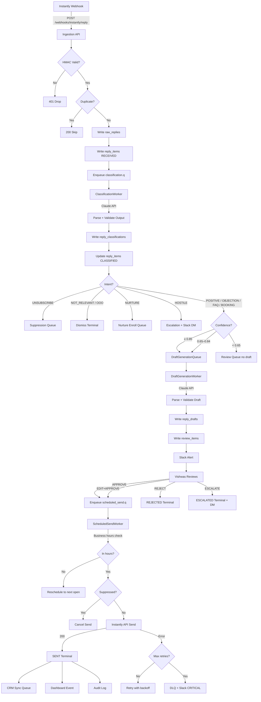
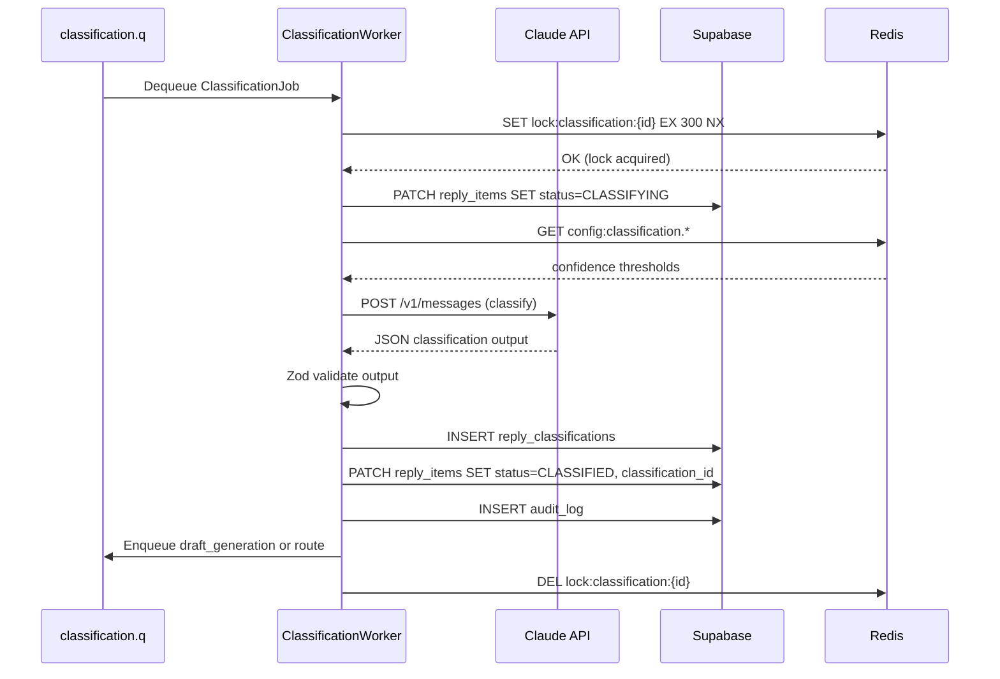
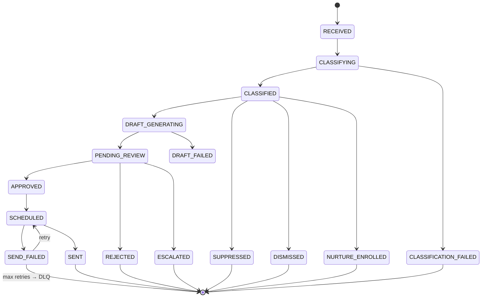

# KRIONICS OS — REPLY INGESTION + CLASSIFICATION + REVIEW QUEUE
## Subsystem Implementation Package · Version 1.0

> **Status:** Production-ready implementation specification.
> **Scope:** Covers webhook ingestion through human approval through auto-send.
> **Assumes:** Supabase (Postgres + Auth + Realtime), Redis (BullMQ), n8n, Claude API, Next.js frontend.

---

## TABLE OF CONTENTS

1. Subsystem Breakdown
2. End-to-End Execution Flow
3. State Machine
4. Database Schema (Supabase)
5. TypeScript Domain Interfaces
6. Zod Validation Schemas
7. Queue Contracts (BullMQ / Redis)
8. Redis Data Structures
9. Event Contracts
10. Webhook Contracts
11. API Contracts
12. n8n Workflow — Node-Level Implementation
13. AI Invocation Pipeline
14. Prompt Templates + Structured Outputs
15. Retry + Failure Handling
16. Idempotency Handling
17. Human Approval Flow
18. Draft Editing Flow
19. Auto-Send Flow
20. Config Loading Flow
21. CRM Sync Flow
22. Slack Alert Flow
23. Logging + Observability
24. Audit Trail Implementation
25. Frontend Screen Specifications
26. Review Queue UX Flow
27. Sequence Diagrams
28. Mermaid Workflow Diagrams
29. Folder Structure
30. Engineering Checklist

---

## 1. SUBSYSTEM BREAKDOWN

### 1.1 Subsystem Name
`reply-ingestion-classification-review` (RICR)

### 1.2 Responsibilities

| Layer | Component | Responsibility |
|---|---|---|
| Ingestion | Instantly Webhook Handler | Receive raw reply event, validate HMAC, enqueue |
| Ingestion | Idempotency Gate | Deduplicate replays within 24h window |
| Classification | Classification Worker | Call Claude API, return intent + confidence + metadata |
| Classification | Routing Engine | Route by intent to correct downstream queue |
| Generation | Draft Generation Worker | Generate reply draft if intent is POSITIVE / OBJECTION / FAQ |
| Review | Review Queue Writer | Write draft + classification to review_items table |
| Review | Slack Alert Worker | Notify Vishwas of new item requiring review |
| Review | Human Approval Handler | Accept edits, approve, reject, or escalate |
| Sending | Scheduled Send Worker | Send approved draft via Instantly API at scheduled time |
| Post-Send | CRM Sync Worker | Push contact + context to HubSpot |
| Post-Send | Dashboard Event Worker | Emit realtime update to Looker Studio / dashboard |
| Post-Send | Audit Writer | Write immutable audit record to audit_log |

### 1.3 Boundary Conditions

- **Entry point:** POST webhook from Instantly on `email.reply.received`
- **Exit points:**
  - Draft sent via Instantly API → `reply_sent`
  - Reply routed to nurture → `nurture_enrolled`
  - Reply marked unsubscribe → `contact_suppressed`
  - Reply escalated to human DM → `escalated`
  - Reply rejected (no action) → `rejected`

### 1.4 External Dependencies

| Service | Usage | Failure Mode |
|---|---|---|
| Instantly.ai | Webhook source + outbound send | Retry 3x, then DLQ |
| Claude API (claude-sonnet-4-20250514) | Classification + draft generation | Retry 3x, then human fallback |
| HubSpot API | CRM push | Retry 5x, then DLQ async |
| Slack API | Alerts | Fire-and-forget, no retry blocking |
| Supabase | Primary store | Circuit breaker on >3 failures/min |
| Redis | Queue + idempotency keys | In-memory fallback for 30s |

---

## 2. END-TO-END EXECUTION FLOW

```
[Instantly] ──webhook──► [Ingestion API]
                               │
                    ┌──────────▼──────────┐
                    │ HMAC validation      │ FAIL ──► 401, drop
                    │ Schema validation    │ FAIL ──► 400, DLQ
                    │ Idempotency check    │ DUP  ──► 200, skip
                    └──────────┬──────────┘
                               │ PASS
                    ┌──────────▼──────────┐
                    │ Write raw_replies   │
                    │ Emit reply.received │
                    └──────────┬──────────┘
                               │
                    ┌──────────▼──────────┐
                    │ classification.q    │ (BullMQ job)
                    └──────────┬──────────┘
                               │
                    ┌──────────▼──────────┐
                    │ ClassificationWorker│
                    │ Claude API call     │
                    │ intent + confidence │
                    └──────────┬──────────┘
                               │
               ┌───────────────┼───────────────┐
               │               │               │
         confidence       confidence       confidence
           ≥ 0.85          0.65–0.84         < 0.65
               │               │               │
        AUTO-ROUTE        SOFT-ROUTE       HUMAN-ROUTE
               │               │               │
     ┌─────────▼─────────┐     │     ┌─────────▼─────────┐
     │ Route by intent:  │     │     │ Review queue:     │
     │ POSITIVE          │     │     │ Classify manually  │
     │ OBJECTION         │     │     └───────────────────┘
     │ FAQ               │     │
     │ BOOKING_INTENT    │     │
     │ NURTURE           │     └────► Review queue (soft)
     │ UNSUBSCRIBE       │
     │ NOT_RELEVANT      │
     └─────────┬─────────┘
               │
    ┌──────────▼──────────┐
    │ DraftGenerationWorker│  (only for POSITIVE / OBJECTION / FAQ / BOOKING_INTENT)
    │ Claude API call      │
    └──────────┬──────────┘
               │
    ┌──────────▼──────────┐
    │ review_items table   │
    │ status: PENDING      │
    └──────────┬──────────┘
               │
    ┌──────────▼──────────┐
    │ Slack alert sent     │
    └──────────┬──────────┘
               │
         [Vishwas reviews in dashboard]
               │
     ┌─────────┴──────────────┐
     │                        │
  APPROVE                  REJECT / EDIT
     │                        │
  schedule_send.q         edit → re-approve
     │
  [Instantly API send]
     │
  CRM sync + audit + dashboard event
```

---

## 3. STATE MACHINE

### 3.1 `reply_items` State Transitions

```
RECEIVED
  └──► CLASSIFYING
         ├──► CLASSIFICATION_FAILED (→ DLQ, human fallback)
         └──► CLASSIFIED
               ├──► [intent: UNSUBSCRIBE]  ──► SUPPRESSED (terminal)
               ├──► [intent: NOT_RELEVANT] ──► DISMISSED (terminal)
               ├──► [intent: NURTURE]      ──► NURTURE_ENROLLED (terminal)
               └──► [intent: requires draft]
                     └──► DRAFT_GENERATING
                           ├──► DRAFT_FAILED (→ human writes draft)
                           └──► PENDING_REVIEW
                                 ├──► APPROVED
                                 │     └──► SCHEDULED
                                 │           └──► SENT (terminal)
                                 │                 └──► [on failure] SEND_FAILED → retry → SENT or DLQ
                                 ├──► REJECTED (terminal)
                                 └──► ESCALATED (terminal, human DM)
```

### 3.2 Valid Transitions Table

| From | To | Trigger | Actor |
|---|---|---|---|
| RECEIVED | CLASSIFYING | classification job dequeued | Worker |
| CLASSIFYING | CLASSIFIED | Claude responds | Worker |
| CLASSIFYING | CLASSIFICATION_FAILED | Claude error after 3 retries | Worker |
| CLASSIFIED | DRAFT_GENERATING | draft job enqueued | Worker |
| CLASSIFIED | SUPPRESSED | intent = UNSUBSCRIBE | Worker |
| CLASSIFIED | DISMISSED | intent = NOT_RELEVANT | Worker |
| CLASSIFIED | NURTURE_ENROLLED | intent = NURTURE | Worker |
| DRAFT_GENERATING | PENDING_REVIEW | draft written | Worker |
| DRAFT_GENERATING | DRAFT_FAILED | Claude error after 3 retries | Worker |
| PENDING_REVIEW | APPROVED | human approves | Vishwas |
| PENDING_REVIEW | REJECTED | human rejects | Vishwas |
| PENDING_REVIEW | ESCALATED | human escalates | Vishwas |
| APPROVED | SCHEDULED | schedule job enqueued | Worker |
| SCHEDULED | SENT | Instantly API confirms | Worker |
| SCHEDULED | SEND_FAILED | Instantly API error | Worker |
| SEND_FAILED | SCHEDULED | retry scheduled | Worker |
| SEND_FAILED | DLQ | max retries exceeded | Worker |

---

## 4. DATABASE SCHEMA (SUPABASE / POSTGRES)

### 4.1 Migration Order

```
001_create_campaigns.sql
002_create_contacts.sql
003_create_raw_replies.sql
004_create_reply_classifications.sql
005_create_reply_drafts.sql
006_create_reply_items.sql          ← main entity (references above)
007_create_review_items.sql
008_create_scheduled_sends.sql
009_create_audit_log.sql
010_create_suppression_list.sql
011_create_idempotency_keys.sql
012_create_config.sql
013_rls_policies.sql
014_indexes.sql
015_triggers.sql
```

### 4.2 Core Tables

#### `raw_replies`
```sql
CREATE TABLE raw_replies (
  id              UUID PRIMARY KEY DEFAULT gen_random_uuid(),
  idempotency_key TEXT UNIQUE NOT NULL,           -- sha256(instantly_reply_id)
  campaign_id     UUID REFERENCES campaigns(id),
  contact_id      UUID REFERENCES contacts(id),
  instantly_reply_id TEXT NOT NULL,
  instantly_email_id TEXT,
  from_email      TEXT NOT NULL,
  from_name       TEXT,
  subject         TEXT,
  body_text       TEXT NOT NULL,
  body_html       TEXT,
  headers         JSONB,
  received_at     TIMESTAMPTZ NOT NULL,
  ingested_at     TIMESTAMPTZ NOT NULL DEFAULT now(),
  raw_payload     JSONB NOT NULL                   -- full webhook body, immutable
);

CREATE INDEX raw_replies_campaign_idx ON raw_replies(campaign_id);
CREATE INDEX raw_replies_contact_idx ON raw_replies(contact_id);
CREATE INDEX raw_replies_received_at_idx ON raw_replies(received_at DESC);
```

#### `reply_items`
```sql
CREATE TYPE reply_status AS ENUM (
  'RECEIVED',
  'CLASSIFYING',
  'CLASSIFIED',
  'CLASSIFICATION_FAILED',
  'DRAFT_GENERATING',
  'DRAFT_FAILED',
  'PENDING_REVIEW',
  'APPROVED',
  'REJECTED',
  'ESCALATED',
  'SCHEDULED',
  'SENT',
  'SEND_FAILED',
  'SUPPRESSED',
  'DISMISSED',
  'NURTURE_ENROLLED'
);

CREATE TABLE reply_items (
  id                  UUID PRIMARY KEY DEFAULT gen_random_uuid(),
  raw_reply_id        UUID NOT NULL REFERENCES raw_replies(id),
  campaign_id         UUID NOT NULL REFERENCES campaigns(id),
  contact_id          UUID NOT NULL REFERENCES contacts(id),
  status              reply_status NOT NULL DEFAULT 'RECEIVED',
  classification_id   UUID REFERENCES reply_classifications(id),
  draft_id            UUID REFERENCES reply_drafts(id),
  review_item_id      UUID REFERENCES review_items(id),
  scheduled_send_id   UUID REFERENCES scheduled_sends(id),
  assigned_to         UUID REFERENCES auth.users(id),
  created_at          TIMESTAMPTZ NOT NULL DEFAULT now(),
  updated_at          TIMESTAMPTZ NOT NULL DEFAULT now(),
  resolved_at         TIMESTAMPTZ,
  metadata            JSONB DEFAULT '{}'
);

CREATE INDEX reply_items_status_idx ON reply_items(status);
CREATE INDEX reply_items_campaign_idx ON reply_items(campaign_id);
CREATE INDEX reply_items_contact_idx ON reply_items(contact_id);
CREATE INDEX reply_items_created_at_idx ON reply_items(created_at DESC);
```

#### `reply_classifications`
```sql
CREATE TYPE reply_intent AS ENUM (
  'POSITIVE',
  'OBJECTION',
  'FAQ',
  'BOOKING_INTENT',
  'NURTURE',
  'UNSUBSCRIBE',
  'NOT_RELEVANT',
  'BOUNCE_OOO',
  'HOSTILE',
  'UNKNOWN'
);

CREATE TABLE reply_classifications (
  id                UUID PRIMARY KEY DEFAULT gen_random_uuid(),
  reply_item_id     UUID NOT NULL REFERENCES reply_items(id),
  intent            reply_intent NOT NULL,
  confidence        NUMERIC(4,3) NOT NULL CHECK (confidence >= 0 AND confidence <= 1),
  sentiment         TEXT CHECK (sentiment IN ('POSITIVE','NEUTRAL','NEGATIVE')),
  urgency           TEXT CHECK (urgency IN ('HIGH','MEDIUM','LOW')),
  key_signals       TEXT[],                     -- extracted phrases that drove classification
  objection_type    TEXT,                       -- populated if intent = OBJECTION
  faq_topic         TEXT,                       -- populated if intent = FAQ
  requires_draft    BOOLEAN NOT NULL DEFAULT false,
  requires_human    BOOLEAN NOT NULL DEFAULT false,
  routing_decision  TEXT NOT NULL,              -- which queue / path
  model_used        TEXT NOT NULL,
  prompt_version    TEXT NOT NULL,
  raw_model_output  JSONB NOT NULL,             -- full Claude response, immutable
  classified_at     TIMESTAMPTZ NOT NULL DEFAULT now(),
  classification_ms INTEGER                     -- latency tracking
);
```

#### `reply_drafts`
```sql
CREATE TABLE reply_drafts (
  id                UUID PRIMARY KEY DEFAULT gen_random_uuid(),
  reply_item_id     UUID NOT NULL REFERENCES reply_items(id),
  classification_id UUID NOT NULL REFERENCES reply_classifications(id),
  version           INTEGER NOT NULL DEFAULT 1,
  subject           TEXT NOT NULL,
  body_text         TEXT NOT NULL,
  body_html         TEXT,
  tone              TEXT CHECK (tone IN ('WARM','DIRECT','PROFESSIONAL','EMPATHETIC')),
  cta_type          TEXT,                       -- 'BOOK_CALL' | 'SEND_RESOURCE' | 'FOLLOW_UP'
  cta_url           TEXT,
  model_used        TEXT NOT NULL,
  prompt_version    TEXT NOT NULL,
  raw_model_output  JSONB NOT NULL,
  generated_at      TIMESTAMPTZ NOT NULL DEFAULT now(),
  generation_ms     INTEGER,
  edited_body_text  TEXT,                       -- populated if human edits before approval
  edited_at         TIMESTAMPTZ,
  edited_by         UUID REFERENCES auth.users(id)
);
```

#### `review_items`
```sql
CREATE TYPE review_action AS ENUM (
  'APPROVE',
  'REJECT',
  'EDIT_AND_APPROVE',
  'ESCALATE',
  'RECLASSIFY'
);

CREATE TABLE review_items (
  id                UUID PRIMARY KEY DEFAULT gen_random_uuid(),
  reply_item_id     UUID NOT NULL REFERENCES reply_items(id),
  draft_id          UUID REFERENCES reply_drafts(id),
  classification_id UUID NOT NULL REFERENCES reply_classifications(id),
  queue_position    INTEGER,
  priority          INTEGER NOT NULL DEFAULT 50,  -- 1=urgent, 100=low
  assigned_to       UUID REFERENCES auth.users(id),
  action_taken      review_action,
  action_at         TIMESTAMPTZ,
  action_by         UUID REFERENCES auth.users(id),
  rejection_reason  TEXT,
  escalation_note   TEXT,
  send_delay_minutes INTEGER DEFAULT 0,          -- 0 = immediate, >0 = scheduled
  created_at        TIMESTAMPTZ NOT NULL DEFAULT now()
);

CREATE INDEX review_items_pending_idx ON review_items(action_taken)
  WHERE action_taken IS NULL;
CREATE INDEX review_items_priority_idx ON review_items(priority ASC, created_at ASC)
  WHERE action_taken IS NULL;
```

#### `scheduled_sends`
```sql
CREATE TYPE send_status AS ENUM (
  'PENDING', 'SENDING', 'SENT', 'FAILED', 'CANCELLED'
);

CREATE TABLE scheduled_sends (
  id              UUID PRIMARY KEY DEFAULT gen_random_uuid(),
  reply_item_id   UUID NOT NULL REFERENCES reply_items(id),
  draft_id        UUID NOT NULL REFERENCES reply_drafts(id),
  to_email        TEXT NOT NULL,
  from_email      TEXT NOT NULL,
  subject         TEXT NOT NULL,
  body_text       TEXT NOT NULL,
  body_html       TEXT,
  scheduled_at    TIMESTAMPTZ NOT NULL,
  status          send_status NOT NULL DEFAULT 'PENDING',
  sent_at         TIMESTAMPTZ,
  instantly_message_id TEXT,
  attempt_count   INTEGER NOT NULL DEFAULT 0,
  last_error      TEXT,
  created_at      TIMESTAMPTZ NOT NULL DEFAULT now()
);

CREATE INDEX scheduled_sends_scheduled_at_idx ON scheduled_sends(scheduled_at ASC)
  WHERE status = 'PENDING';
```

#### `audit_log`
```sql
CREATE TABLE audit_log (
  id            BIGSERIAL PRIMARY KEY,
  entity_type   TEXT NOT NULL,        -- 'reply_item' | 'review_item' | 'scheduled_send'
  entity_id     UUID NOT NULL,
  event         TEXT NOT NULL,        -- 'status_changed' | 'draft_edited' | 'approved' etc.
  from_state    TEXT,
  to_state      TEXT,
  actor_type    TEXT NOT NULL,        -- 'worker' | 'user' | 'system'
  actor_id      TEXT,                 -- user UUID or worker name
  payload       JSONB,
  occurred_at   TIMESTAMPTZ NOT NULL DEFAULT now()
);
-- Append-only. No UPDATE or DELETE allowed via RLS.

CREATE INDEX audit_log_entity_idx ON audit_log(entity_type, entity_id);
CREATE INDEX audit_log_occurred_at_idx ON audit_log(occurred_at DESC);
```

#### `suppression_list`
```sql
CREATE TABLE suppression_list (
  id            UUID PRIMARY KEY DEFAULT gen_random_uuid(),
  email         TEXT UNIQUE NOT NULL,
  campaign_id   UUID REFERENCES campaigns(id),  -- NULL = global suppression
  reason        TEXT NOT NULL,                   -- 'UNSUBSCRIBE' | 'BOUNCE' | 'HOSTILE' | 'MANUAL'
  reply_item_id UUID REFERENCES reply_items(id),
  suppressed_at TIMESTAMPTZ NOT NULL DEFAULT now(),
  suppressed_by TEXT NOT NULL                    -- 'system' or user id
);

CREATE INDEX suppression_list_email_idx ON suppression_list(email);
```

#### `idempotency_keys`
```sql
CREATE TABLE idempotency_keys (
  key         TEXT PRIMARY KEY,
  entity_id   UUID NOT NULL,
  entity_type TEXT NOT NULL,
  created_at  TIMESTAMPTZ NOT NULL DEFAULT now(),
  expires_at  TIMESTAMPTZ NOT NULL DEFAULT now() + INTERVAL '48 hours'
);

CREATE INDEX idempotency_keys_expires_at_idx ON idempotency_keys(expires_at);
-- Cron: DELETE FROM idempotency_keys WHERE expires_at < now(); (run hourly)
```

#### `config`
```sql
CREATE TABLE config (
  key           TEXT PRIMARY KEY,
  value         JSONB NOT NULL,
  description   TEXT,
  updated_at    TIMESTAMPTZ NOT NULL DEFAULT now(),
  updated_by    TEXT
);

-- Seed values:
INSERT INTO config VALUES
  ('classification.confidence.auto_route', '"0.85"', 'Min confidence for auto-routing', now(), 'seed'),
  ('classification.confidence.soft_route', '"0.65"', 'Min confidence for soft routing', now(), 'seed'),
  ('classification.prompt_version', '"v1.0"', 'Active prompt version', now(), 'seed'),
  ('draft.prompt_version', '"v1.0"', 'Active draft prompt version', now(), 'seed'),
  ('send.default_delay_minutes', '"15"', 'Default delay before sending approved drafts', now(), 'seed'),
  ('send.business_hours_only', '"true"', 'Only send within 9-5 prospect timezone', now(), 'seed'),
  ('slack.channel_review_alerts', '"#reply-review"', 'Slack channel for new review items', now(), 'seed'),
  ('slack.channel_sent_alerts', '"#pipeline-activity"', 'Slack channel for sent confirmations', now(), 'seed');
```

### 4.3 RLS Policies

```sql
-- audit_log: insert only, no delete, no update
ALTER TABLE audit_log ENABLE ROW LEVEL SECURITY;
CREATE POLICY audit_insert ON audit_log FOR INSERT TO authenticated WITH CHECK (true);
CREATE POLICY audit_select ON audit_log FOR SELECT TO authenticated USING (true);
-- No UPDATE or DELETE policies → enforces append-only

-- reply_items, review_items: team members only
ALTER TABLE reply_items ENABLE ROW LEVEL SECURITY;
CREATE POLICY reply_items_team ON reply_items
  USING (auth.role() = 'authenticated');

-- suppression_list: readable by all authenticated, writable by service_role only
ALTER TABLE suppression_list ENABLE ROW LEVEL SECURITY;
CREATE POLICY supp_read ON suppression_list FOR SELECT TO authenticated USING (true);
CREATE POLICY supp_write ON suppression_list FOR INSERT TO service_role WITH CHECK (true);
```

### 4.4 Triggers

```sql
-- Auto-update updated_at on reply_items
CREATE OR REPLACE FUNCTION set_updated_at()
RETURNS TRIGGER AS $$
BEGIN
  NEW.updated_at = now();
  RETURN NEW;
END;
$$ LANGUAGE plpgsql;

CREATE TRIGGER reply_items_updated_at
  BEFORE UPDATE ON reply_items
  FOR EACH ROW EXECUTE FUNCTION set_updated_at();

-- Auto-write audit log on reply_items status change
CREATE OR REPLACE FUNCTION audit_reply_status_change()
RETURNS TRIGGER AS $$
BEGIN
  IF OLD.status IS DISTINCT FROM NEW.status THEN
    INSERT INTO audit_log(entity_type, entity_id, event, from_state, to_state, actor_type)
    VALUES ('reply_item', NEW.id, 'status_changed', OLD.status::TEXT, NEW.status::TEXT, 'system');
  END IF;
  RETURN NEW;
END;
$$ LANGUAGE plpgsql;

CREATE TRIGGER reply_items_audit_status
  AFTER UPDATE ON reply_items
  FOR EACH ROW EXECUTE FUNCTION audit_reply_status_change();
```

---

## 5. TYPESCRIPT DOMAIN INTERFACES

```typescript
// packages/schema/src/reply/domain.ts

// ─── Branded IDs ────────────────────────────────────────────────────────────
declare const __brand: unique symbol;
type Brand<T, B> = T & { [__brand]: B };

export type ReplyItemId       = Brand<string, 'ReplyItemId'>;
export type RawReplyId        = Brand<string, 'RawReplyId'>;
export type CampaignId        = Brand<string, 'CampaignId'>;
export type ContactId         = Brand<string, 'ContactId'>;
export type ClassificationId  = Brand<string, 'ClassificationId'>;
export type DraftId           = Brand<string, 'DraftId'>;
export type ReviewItemId      = Brand<string, 'ReviewItemId'>;
export type ScheduledSendId   = Brand<string, 'ScheduledSendId'>;
export type UserId            = Brand<string, 'UserId'>;

// ─── Enums ──────────────────────────────────────────────────────────────────
export type ReplyStatus =
  | 'RECEIVED' | 'CLASSIFYING' | 'CLASSIFIED' | 'CLASSIFICATION_FAILED'
  | 'DRAFT_GENERATING' | 'DRAFT_FAILED' | 'PENDING_REVIEW'
  | 'APPROVED' | 'REJECTED' | 'ESCALATED'
  | 'SCHEDULED' | 'SENT' | 'SEND_FAILED'
  | 'SUPPRESSED' | 'DISMISSED' | 'NURTURE_ENROLLED';

export type ReplyIntent =
  | 'POSITIVE' | 'OBJECTION' | 'FAQ' | 'BOOKING_INTENT'
  | 'NURTURE' | 'UNSUBSCRIBE' | 'NOT_RELEVANT'
  | 'BOUNCE_OOO' | 'HOSTILE' | 'UNKNOWN';

export type ReplyAction = 'APPROVE' | 'REJECT' | 'EDIT_AND_APPROVE' | 'ESCALATE' | 'RECLASSIFY';
export type Sentiment   = 'POSITIVE' | 'NEUTRAL' | 'NEGATIVE';
export type Urgency     = 'HIGH' | 'MEDIUM' | 'LOW';
export type DraftTone   = 'WARM' | 'DIRECT' | 'PROFESSIONAL' | 'EMPATHETIC';
export type CTAType     = 'BOOK_CALL' | 'SEND_RESOURCE' | 'FOLLOW_UP' | 'NONE';
export type SendStatus  = 'PENDING' | 'SENDING' | 'SENT' | 'FAILED' | 'CANCELLED';

// ─── Core Entities ──────────────────────────────────────────────────────────
export interface RawReply {
  readonly id: RawReplyId;
  readonly idempotencyKey: string;
  readonly campaignId: CampaignId;
  readonly contactId: ContactId;
  readonly instantlyReplyId: string;
  readonly instantlyEmailId: string | null;
  readonly fromEmail: string;
  readonly fromName: string | null;
  readonly subject: string | null;
  readonly bodyText: string;
  readonly bodyHtml: string | null;
  readonly headers: Record<string, string>;
  readonly receivedAt: string;   // ISO-8601
  readonly ingestedAt: string;
  readonly rawPayload: unknown;
}

export interface ReplyItem {
  readonly id: ReplyItemId;
  readonly rawReplyId: RawReplyId;
  readonly campaignId: CampaignId;
  readonly contactId: ContactId;
  status: ReplyStatus;
  classificationId: ClassificationId | null;
  draftId: DraftId | null;
  reviewItemId: ReviewItemId | null;
  scheduledSendId: ScheduledSendId | null;
  assignedTo: UserId | null;
  readonly createdAt: string;
  updatedAt: string;
  resolvedAt: string | null;
  metadata: Record<string, unknown>;
}

export interface ReplyClassification {
  readonly id: ClassificationId;
  readonly replyItemId: ReplyItemId;
  readonly intent: ReplyIntent;
  readonly confidence: number;             // 0.000 – 1.000
  readonly sentiment: Sentiment;
  readonly urgency: Urgency;
  readonly keySignals: readonly string[];
  readonly objectionType: string | null;
  readonly faqTopic: string | null;
  readonly requiresDraft: boolean;
  readonly requiresHuman: boolean;
  readonly routingDecision: string;
  readonly modelUsed: string;
  readonly promptVersion: string;
  readonly rawModelOutput: unknown;
  readonly classifiedAt: string;
  readonly classificationMs: number | null;
}

export interface ReplyDraft {
  readonly id: DraftId;
  readonly replyItemId: ReplyItemId;
  readonly classificationId: ClassificationId;
  readonly version: number;
  readonly subject: string;
  readonly bodyText: string;
  readonly bodyHtml: string | null;
  readonly tone: DraftTone;
  readonly ctaType: CTAType;
  readonly ctaUrl: string | null;
  readonly modelUsed: string;
  readonly promptVersion: string;
  readonly rawModelOutput: unknown;
  readonly generatedAt: string;
  readonly generationMs: number | null;
  editedBodyText: string | null;
  editedAt: string | null;
  editedBy: UserId | null;
}

export interface ReviewItem {
  readonly id: ReviewItemId;
  readonly replyItemId: ReplyItemId;
  readonly draftId: DraftId | null;
  readonly classificationId: ClassificationId;
  readonly priority: number;
  assignedTo: UserId | null;
  actionTaken: ReplyAction | null;
  actionAt: string | null;
  actionBy: UserId | null;
  rejectionReason: string | null;
  escalationNote: string | null;
  sendDelayMinutes: number;
  readonly createdAt: string;
}

export interface ScheduledSend {
  readonly id: ScheduledSendId;
  readonly replyItemId: ReplyItemId;
  readonly draftId: DraftId;
  readonly toEmail: string;
  readonly fromEmail: string;
  readonly subject: string;
  readonly bodyText: string;
  readonly bodyHtml: string | null;
  scheduledAt: string;
  status: SendStatus;
  sentAt: string | null;
  instantlyMessageId: string | null;
  attemptCount: number;
  lastError: string | null;
  readonly createdAt: string;
}

// ─── Composite / View Types ──────────────────────────────────────────────────
export interface ReviewQueueItem {
  readonly reviewItem: ReviewItem;
  readonly replyItem: ReplyItem;
  readonly rawReply: Pick<RawReply, 'fromEmail' | 'fromName' | 'subject' | 'bodyText' | 'receivedAt'>;
  readonly classification: ReplyClassification;
  readonly draft: ReplyDraft | null;
  readonly contact: ContactSummary;
  readonly campaign: CampaignSummary;
}

export interface ContactSummary {
  readonly id: ContactId;
  readonly email: string;
  readonly firstName: string | null;
  readonly lastName: string | null;
  readonly company: string | null;
  readonly title: string | null;
  readonly linkedinUrl: string | null;
}

export interface CampaignSummary {
  readonly id: CampaignId;
  readonly name: string;
  readonly clientId: string;
  readonly fromEmail: string;
}

// ─── Audit ──────────────────────────────────────────────────────────────────
export interface AuditEntry {
  readonly id: number;
  readonly entityType: string;
  readonly entityId: string;
  readonly event: string;
  readonly fromState: string | null;
  readonly toState: string | null;
  readonly actorType: 'worker' | 'user' | 'system';
  readonly actorId: string | null;
  readonly payload: unknown;
  readonly occurredAt: string;
}
```

---

## 6. ZOD VALIDATION SCHEMAS

```typescript
// packages/schema/src/reply/zod.ts
import { z } from 'zod';

// ─── Webhook Payload ─────────────────────────────────────────────────────────
export const InstantlyReplyWebhookSchema = z.object({
  event:        z.literal('email.reply.received'),
  timestamp:    z.string().datetime(),
  data: z.object({
    reply_id:       z.string().min(1),
    email_id:       z.string().optional(),
    campaign_id:    z.string().min(1),
    from_email:     z.string().email(),
    from_name:      z.string().optional(),
    to_email:       z.string().email(),
    subject:        z.string().optional(),
    body_text:      z.string().min(1),
    body_html:      z.string().optional(),
    received_at:    z.string().datetime(),
    headers:        z.record(z.string()).optional().default({}),
  }),
});
export type InstantlyReplyWebhook = z.infer<typeof InstantlyReplyWebhookSchema>;

// ─── Classification Output ───────────────────────────────────────────────────
export const ClassificationOutputSchema = z.object({
  intent: z.enum([
    'POSITIVE', 'OBJECTION', 'FAQ', 'BOOKING_INTENT',
    'NURTURE', 'UNSUBSCRIBE', 'NOT_RELEVANT',
    'BOUNCE_OOO', 'HOSTILE', 'UNKNOWN'
  ]),
  confidence:     z.number().min(0).max(1),
  sentiment:      z.enum(['POSITIVE', 'NEUTRAL', 'NEGATIVE']),
  urgency:        z.enum(['HIGH', 'MEDIUM', 'LOW']),
  key_signals:    z.array(z.string()).max(5),
  objection_type: z.string().nullable(),
  faq_topic:      z.string().nullable(),
  reasoning:      z.string().max(500),
  requires_draft: z.boolean(),
  requires_human: z.boolean(),
  routing:        z.string(),
});
export type ClassificationOutput = z.infer<typeof ClassificationOutputSchema>;

// ─── Draft Output ────────────────────────────────────────────────────────────
export const DraftOutputSchema = z.object({
  subject:    z.string().min(1).max(200),
  body_text:  z.string().min(10).max(2000),
  body_html:  z.string().optional(),
  tone:       z.enum(['WARM', 'DIRECT', 'PROFESSIONAL', 'EMPATHETIC']),
  cta_type:   z.enum(['BOOK_CALL', 'SEND_RESOURCE', 'FOLLOW_UP', 'NONE']),
  cta_url:    z.string().url().nullable(),
  word_count: z.number().int().max(300),
  notes:      z.string().max(300).optional(),
});
export type DraftOutput = z.infer<typeof DraftOutputSchema>;

// ─── Review Action ────────────────────────────────────────────────────────────
export const ReviewActionRequestSchema = z.object({
  reviewItemId:    z.string().uuid(),
  action:          z.enum(['APPROVE', 'REJECT', 'EDIT_AND_APPROVE', 'ESCALATE', 'RECLASSIFY']),
  editedBody:      z.string().min(10).max(2000).optional(),
  rejectionReason: z.string().max(500).optional(),
  escalationNote:  z.string().max(1000).optional(),
  sendDelayMinutes: z.number().int().min(0).max(1440).default(0),
  newIntent:       z.string().optional(),   // if action = RECLASSIFY
});
export type ReviewActionRequest = z.infer<typeof ReviewActionRequestSchema>;

// ─── Queue Job Payloads ───────────────────────────────────────────────────────
export const ClassificationJobSchema = z.object({
  jobType:        z.literal('classify_reply'),
  replyItemId:    z.string().uuid(),
  rawReplyId:     z.string().uuid(),
  campaignId:     z.string().uuid(),
  contactId:      z.string().uuid(),
  bodyText:       z.string(),
  fromEmail:      z.string().email(),
  fromName:       z.string().nullable(),
  subject:        z.string().nullable(),
  promptVersion:  z.string().default('v1.0'),
  enqueuedAt:     z.string().datetime(),
});
export type ClassificationJob = z.infer<typeof ClassificationJobSchema>;

export const DraftGenerationJobSchema = z.object({
  jobType:          z.literal('generate_draft'),
  replyItemId:      z.string().uuid(),
  classificationId: z.string().uuid(),
  intent:           z.string(),
  bodyText:         z.string(),
  fromEmail:        z.string().email(),
  fromName:         z.string().nullable(),
  campaignContext:  z.object({
    campaignName:   z.string(),
    serviceType:    z.enum(['SERVICE_A', 'SERVICE_B']),
    clientName:     z.string(),
    calendlyUrl:    z.string().url(),
    fromName:       z.string(),
  }),
  promptVersion:    z.string().default('v1.0'),
  enqueuedAt:       z.string().datetime(),
});
export type DraftGenerationJob = z.infer<typeof DraftGenerationJobSchema>;

export const ScheduledSendJobSchema = z.object({
  jobType:          z.literal('send_reply'),
  scheduledSendId:  z.string().uuid(),
  replyItemId:      z.string().uuid(),
  draftId:          z.string().uuid(),
  toEmail:          z.string().email(),
  fromEmail:        z.string().email(),
  subject:          z.string(),
  bodyText:         z.string(),
  scheduledAt:      z.string().datetime(),
  attemptNumber:    z.number().int().default(1),
});
export type ScheduledSendJob = z.infer<typeof ScheduledSendJobSchema>;
```

---

## 7. QUEUE CONTRACTS (BULLMQ)

### 7.1 Queue Definitions

```typescript
// packages/queue/src/queues.ts
import { Queue, QueueOptions } from 'bullmq';
import { redis } from './redis-connection';

const DEFAULT_OPTS: QueueOptions = {
  connection: redis,
  defaultJobOptions: {
    removeOnComplete: { count: 1000, age: 86400 },
    removeOnFail:     { count: 5000, age: 604800 },
  },
};

export const classificationQueue = new Queue('reply:classification', {
  ...DEFAULT_OPTS,
  defaultJobOptions: {
    ...DEFAULT_OPTS.defaultJobOptions,
    attempts: 3,
    backoff: { type: 'exponential', delay: 2000 },
    priority: 50,
  },
});

export const draftGenerationQueue = new Queue('reply:draft_generation', {
  ...DEFAULT_OPTS,
  defaultJobOptions: {
    ...DEFAULT_OPTS.defaultJobOptions,
    attempts: 3,
    backoff: { type: 'exponential', delay: 3000 },
    priority: 50,
  },
});

export const scheduledSendQueue = new Queue('reply:scheduled_send', {
  ...DEFAULT_OPTS,
  defaultJobOptions: {
    ...DEFAULT_OPTS.defaultJobOptions,
    attempts: 5,
    backoff: { type: 'exponential', delay: 5000 },
    delay: 0,   // set per-job via options
  },
});

export const crmSyncQueue = new Queue('reply:crm_sync', {
  ...DEFAULT_OPTS,
  defaultJobOptions: {
    ...DEFAULT_OPTS.defaultJobOptions,
    attempts: 5,
    backoff: { type: 'exponential', delay: 10000 },
  },
});

export const slackAlertQueue = new Queue('reply:slack_alert', {
  ...DEFAULT_OPTS,
  defaultJobOptions: {
    ...DEFAULT_OPTS.defaultJobOptions,
    attempts: 2,
    backoff: { type: 'fixed', delay: 2000 },
    priority: 10,   // high priority
  },
});

export const nurturQueue = new Queue('reply:nurture_enroll', {
  ...DEFAULT_OPTS,
  defaultJobOptions: {
    ...DEFAULT_OPTS.defaultJobOptions,
    attempts: 3,
    backoff: { type: 'exponential', delay: 5000 },
  },
});

export const suppressionQueue = new Queue('reply:suppression', {
  ...DEFAULT_OPTS,
  defaultJobOptions: {
    ...DEFAULT_OPTS.defaultJobOptions,
    attempts: 3,
    backoff: { type: 'fixed', delay: 1000 },
    priority: 1,   // highest priority — unsubscribes are urgent
  },
});

export const deadLetterQueue = new Queue('reply:dlq', {
  ...DEFAULT_OPTS,
  defaultJobOptions: {
    ...DEFAULT_OPTS.defaultJobOptions,
    attempts: 1,
    removeOnFail: false,    // keep DLQ jobs forever for inspection
  },
});
```

### 7.2 Job Priority Rules

| Intent / Situation | Queue | Priority (1=high) |
|---|---|---|
| UNSUBSCRIBE reply | suppressionQueue | 1 |
| POSITIVE / BOOKING_INTENT | classificationQueue | 10 |
| HOSTILE | classificationQueue | 10 |
| OBJECTION / FAQ | classificationQueue | 30 |
| NURTURE | nurturQueue | 70 |
| NOT_RELEVANT | (dismiss, no queue) | — |

### 7.3 DLQ Routing Rules

```typescript
// Any job that exhausts retries is moved to DLQ with original payload + error context
export async function moveToDLQ(
  originalQueue: string,
  jobName: string,
  payload: unknown,
  error: Error,
  attemptsMade: number
) {
  await deadLetterQueue.add('dlq_entry', {
    originalQueue,
    jobName,
    payload,
    error: { message: error.message, stack: error.stack },
    attemptsMade,
    failedAt: new Date().toISOString(),
  });
}
```

---

## 8. REDIS DATA STRUCTURES

```
# Idempotency gate (24h TTL)
SET  idempotency:{sha256(instantly_reply_id)}  {replyItemId}  EX 86400
GET  idempotency:{key}                          → replyItemId or nil

# Classification lock (prevent double-processing)
SET  lock:classification:{replyItemId}  1  EX 300  NX   → OK or nil

# Config cache (1h TTL, refreshed on write)
SET  config:classification.confidence.auto_route  "0.85"  EX 3600

# Review queue counter (realtime badge count)
INCR  review_queue:pending_count
DECR  review_queue:pending_count   (on action taken)

# Rate limiting: Claude API calls
INCR  ratelimit:claude:{minute_bucket}   EX 60   # max 50/min
INCR  ratelimit:instantly:{minute_bucket} EX 60  # max 20/min

# Session: draft being edited (prevents concurrent edits)
SET  editing:{reviewItemId}  {userId}  EX 300  NX   → OK (locked) or nil
DEL  editing:{reviewItemId}                          (on save or timeout)
```

---

## 9. EVENT CONTRACTS

All events are published to Supabase Realtime and optionally to a Postgres `events` table.

```typescript
// packages/schema/src/events.ts

export type EventType =
  | 'reply.received'
  | 'reply.classification.started'
  | 'reply.classification.completed'
  | 'reply.classification.failed'
  | 'reply.draft.generation.started'
  | 'reply.draft.generation.completed'
  | 'reply.draft.generation.failed'
  | 'reply.review.queued'
  | 'reply.review.action_taken'
  | 'reply.send.scheduled'
  | 'reply.send.sent'
  | 'reply.send.failed'
  | 'reply.suppressed'
  | 'reply.nurture.enrolled'
  | 'reply.escalated';

export interface EventEnvelope<T = unknown> {
  readonly id: string;                  // UUID v4
  readonly type: EventType;
  readonly version: '1.0';
  readonly source: string;              // 'ingestion-api' | 'classification-worker' | etc.
  readonly replyItemId: string;
  readonly campaignId: string;
  readonly occurredAt: string;          // ISO-8601
  readonly payload: T;
}

// Example payloads:
export interface ReplyReceivedPayload {
  rawReplyId: string;
  fromEmail: string;
  subject: string | null;
  receivedAt: string;
}

export interface ClassificationCompletedPayload {
  classificationId: string;
  intent: string;
  confidence: number;
  requiresDraft: boolean;
  routingDecision: string;
}

export interface ReviewQueuedPayload {
  reviewItemId: string;
  priority: number;
  draftId: string | null;
}

export interface ReviewActionPayload {
  reviewItemId: string;
  action: string;
  actionBy: string;
  sendDelayMinutes: number;
}
```

---

## 10. WEBHOOK CONTRACTS

### 10.1 Incoming Webhook: Instantly → Krionics

```
POST /webhooks/instantly/reply
Content-Type: application/json
X-Instantly-Signature: sha256=<hmac_hex>
X-Instantly-Timestamp: <unix_timestamp>

{
  "event": "email.reply.received",
  "timestamp": "2026-05-18T09:00:00Z",
  "data": {
    "reply_id": "inst_rpl_abc123",
    "email_id": "inst_email_xyz",
    "campaign_id": "inst_cmp_456",
    "from_email": "ceo@targetcompany.com",
    "from_name": "Alex Johnson",
    "to_email": "aryan@krionics.com",
    "subject": "Re: Quick question about [Company]'s outbound",
    "body_text": "Hey, this is interesting. We've been looking at this...",
    "body_html": "<html>...",
    "received_at": "2026-05-18T08:58:00Z",
    "headers": { "Message-ID": "<abc@mail.google.com>" }
  }
}
```

**HMAC Validation:**
```typescript
import crypto from 'crypto';

export function validateInstantlyHMAC(
  rawBody: Buffer,
  signature: string,
  timestamp: string,
  secret: string
): boolean {
  // Reject if timestamp is >5 minutes old (replay protection)
  const ts = parseInt(timestamp, 10);
  if (Math.abs(Date.now() / 1000 - ts) > 300) return false;

  const expected = crypto
    .createHmac('sha256', secret)
    .update(`${timestamp}.${rawBody.toString()}`)
    .digest('hex');

  return crypto.timingSafeEqual(
    Buffer.from(signature.replace('sha256=', ''), 'hex'),
    Buffer.from(expected, 'hex')
  );
}
```

### 10.2 Outgoing Webhook: Krionics → HubSpot

```
POST https://api.hubapi.com/crm/v3/objects/contacts/{contactId}
Authorization: Bearer {HS_ACCESS_TOKEN}

PATCH body:
{
  "properties": {
    "reply_intent":          "POSITIVE",
    "reply_confidence":      "0.94",
    "last_reply_date":       "2026-05-18",
    "last_reply_body":       "Hey, this is interesting...",
    "pipeline_stage":        "REPLIED_POSITIVE",
    "krionics_review_status": "PENDING_REVIEW"
  }
}
```

---

## 11. API CONTRACTS

### 11.1 Ingestion API

```
POST /api/v1/webhooks/instantly/reply
├── Auth:          HMAC (X-Instantly-Signature)
├── Rate limit:    500/min (webhook volume)
├── Idempotency:   X-Idempotency-Key header optional; falls back to sha256(reply_id)
│
├── 200 OK:        { "status": "accepted", "replyItemId": "uuid" }
├── 200 OK:        { "status": "duplicate", "replyItemId": "existing_uuid" }  (idempotent replay)
├── 400:           { "error": "INVALID_PAYLOAD", "details": [...] }
├── 401:           { "error": "INVALID_SIGNATURE" }
└── 500:           { "error": "INTERNAL_ERROR", "reference": "err_uuid" }
```

### 11.2 Review Queue API

```
GET /api/v1/review-queue
├── Auth:          Bearer (Supabase session)
├── Query params:
│   ├── status     = 'PENDING' | 'ALL'          default: PENDING
│   ├── campaign   = campaignId
│   ├── intent     = ReplyIntent
│   ├── page       = integer                     default: 1
│   ├── limit      = integer (max 50)            default: 20
│   └── sort       = 'priority' | 'created_at'  default: priority
│
└── 200 OK:
    {
      "data": ReviewQueueItem[],
      "pagination": {
        "page": 1,
        "limit": 20,
        "total": 47,
        "hasNext": true
      },
      "meta": {
        "pendingCount": 47,
        "urgentCount": 3
      }
    }

GET /api/v1/review-queue/:reviewItemId
├── Auth:  Bearer
└── 200 OK: ReviewQueueItem (full detail)

POST /api/v1/review-queue/:reviewItemId/action
├── Auth:          Bearer
├── Idempotency:   X-Idempotency-Key required
├── Body:          ReviewActionRequest (Zod-validated)
│
├── 200 OK:        { "status": "ok", "replyItemId": "uuid", "nextState": "APPROVED" }
├── 409 Conflict:  { "error": "ALREADY_ACTIONED", "action": "APPROVE", "at": "..." }
├── 409 Conflict:  { "error": "EDIT_LOCKED", "lockedBy": "userId", "expiresAt": "..." }
└── 422:           { "error": "INVALID_TRANSITION", "from": "REJECTED", "to": "APPROVED" }

GET /api/v1/review-queue/:reviewItemId/audit
├── Auth:  Bearer
└── 200 OK: { "events": AuditEntry[] }

POST /api/v1/review-queue/:reviewItemId/lock-edit
├── Auth:  Bearer
└── 200 OK:  { "locked": true, "expiresAt": "..." }
└── 409:     { "error": "ALREADY_LOCKED", "by": "userId" }

DELETE /api/v1/review-queue/:reviewItemId/lock-edit
├── Auth:  Bearer
└── 200 OK: { "released": true }
```

### 11.3 Dashboard Stats API

```
GET /api/v1/dashboard/reply-stats
├── Auth:  Bearer
├── Query: campaign=uuid, from=ISO-date, to=ISO-date
└── 200 OK:
    {
      "repliesReceived":   142,
      "positiveReplies":   18,
      "meetingsBooked":    7,
      "reviewPending":     4,
      "avgClassifyMs":     1240,
      "intentBreakdown": {
        "POSITIVE":       18,
        "OBJECTION":      12,
        "FAQ":            8,
        "NURTURE":        31,
        "UNSUBSCRIBE":    5,
        "NOT_RELEVANT":   68
      }
    }
```

---

## 12. N8N WORKFLOW — NODE-LEVEL IMPLEMENTATION

### 12.1 Workflow: `wf_reply_ingestion`

**Trigger:** Webhook node listening at `/webhook/instantly-reply`

```
[Webhook Node]
  name: "Instantly Reply Webhook"
  method: POST
  path: /instantly-reply
  auth: Header Auth
  ─── outputs: raw webhook body + headers ───►

[Code Node: HMAC Validation]
  name: "Validate HMAC Signature"
  code: |
    const crypto = require('crypto');
    const sig = $input.first().headers['x-instantly-signature'];
    const ts  = $input.first().headers['x-instantly-timestamp'];
    const body = JSON.stringify($input.first().body);
    const secret = $env.INSTANTLY_WEBHOOK_SECRET;
    const expected = crypto.createHmac('sha256', secret)
      .update(`${ts}.${body}`).digest('hex');
    const valid = sig === `sha256=${expected}`;
    if (!valid) throw new Error('HMAC_INVALID');
    return [{ json: { ...$input.first().body, _validated: true } }];
  ─── on error ──► [Respond to Webhook: 401] ───►

[HTTP Request Node: Idempotency Check]
  name: "Check Idempotency"
  method: GET
  url: {{ $env.SUPABASE_URL }}/rest/v1/idempotency_keys?key=eq.{{ $json.data.reply_id | sha256 }}
  headers: { apikey: $env.SUPABASE_ANON_KEY, Authorization: Bearer $env.SUPABASE_SERVICE_KEY }
  ─── outputs: array (empty = new, populated = duplicate) ───►

[IF Node: Duplicate Check]
  name: "Is Duplicate?"
  condition: {{ $json[0] }} EXISTS
  ─── true  ──► [Respond: 200 duplicate] ──► END
  ─── false ──► continue ───►

[HTTP Request Node: Write raw_replies]
  name: "Insert Raw Reply"
  method: POST
  url: {{ $env.SUPABASE_URL }}/rest/v1/raw_replies
  body: {
    idempotency_key: {{ $json.data.reply_id | sha256 }},
    instantly_reply_id: {{ $json.data.reply_id }},
    campaign_id: {{ $json.data.campaign_id }},
    ...
  }
  ─── outputs: { id: rawReplyId } ───►

[HTTP Request Node: Write reply_items]
  name: "Create Reply Item"
  method: POST
  url: {{ $env.SUPABASE_URL }}/rest/v1/reply_items
  body: { raw_reply_id: ..., campaign_id: ..., contact_id: ..., status: 'RECEIVED' }
  ─── outputs: { id: replyItemId } ───►

[HTTP Request Node: Write idempotency_key]
  name: "Write Idempotency Key"
  method: POST
  url: {{ $env.SUPABASE_URL }}/rest/v1/idempotency_keys
  body: { key: ..., entity_id: replyItemId, entity_type: 'reply_item' }

[HTTP Request Node: Enqueue Classification]
  name: "Enqueue Classification Job"
  method: POST
  url: {{ $env.QUEUE_API_URL }}/enqueue
  body: {
    queue: "reply:classification",
    payload: {
      jobType: "classify_reply",
      replyItemId: ...,
      rawReplyId: ...,
      bodyText: ...,
      ...
    },
    priority: 50
  }

[Respond to Webhook: 200]
  name: "Respond Accepted"
  body: { status: "accepted", replyItemId: ... }
```

### 12.2 Workflow: `wf_classification_worker`

**Trigger:** Queue Consumer — `reply:classification`

```
[Queue Trigger Node]
  name: "Poll Classification Queue"
  queue: reply:classification
  concurrency: 3
  ─── outputs: ClassificationJob payload ───►

[HTTP Request Node: Update Status]
  name: "Set Status CLASSIFYING"
  PATCH reply_items where id = replyItemId → status = 'CLASSIFYING'

[HTTP Request Node: Load Config]
  name: "Load Confidence Thresholds"
  GET config where key IN ('classification.confidence.auto_route', 'classification.confidence.soft_route')

[HTTP Request Node: Claude Classification]
  name: "Claude API — Classify Intent"
  method: POST
  url: https://api.anthropic.com/v1/messages
  headers: { x-api-key: $env.ANTHROPIC_API_KEY, anthropic-version: "2023-06-01" }
  body: {
    model: "claude-sonnet-4-20250514",
    max_tokens: 1024,
    system: << CLASSIFICATION_SYSTEM_PROMPT >>,
    messages: [{ role: "user", content: << built from bodyText + context >> }]
  }
  timeout: 30000
  ─── on error ──► [Retry Logic] ───►

[Code Node: Parse + Validate Output]
  name: "Parse Classification Output"
  code: |
    const raw = $input.first().json.content[0].text;
    let parsed;
    try { parsed = JSON.parse(raw); } catch { throw new Error('JSON_PARSE_FAILED'); }
    // Zod validate
    const result = ClassificationOutputSchema.safeParse(parsed);
    if (!result.success) throw new Error('SCHEMA_INVALID: ' + JSON.stringify(result.error));
    return [{ json: { ...result.data, rawOutput: parsed } }];

[HTTP Request Node: Write Classification]
  name: "Insert reply_classifications"
  POST → reply_classifications

[HTTP Request Node: Update Reply Item]
  name: "Set Status CLASSIFIED + classificationId"
  PATCH reply_items

[Switch Node: Route by Intent]
  name: "Intent Router"
  cases:
    POSITIVE       → [Draft Generation Queue]
    OBJECTION      → [Draft Generation Queue]
    FAQ            → [Draft Generation Queue]
    BOOKING_INTENT → [Draft Generation Queue]
    NURTURE        → [Nurture Enroll Queue]
    UNSUBSCRIBE    → [Suppression Queue]
    NOT_RELEVANT   → [Dismiss Handler]
    BOUNCE_OOO     → [Dismiss Handler]
    HOSTILE        → [Escalation Handler]
    default        → [Human Review Queue (low confidence)]

[IF Node: Confidence Gate]
  name: "Check Confidence Threshold"
  On draft-requiring intents only:
  ≥ 0.85 → auto-route to DraftGenerationQueue
  0.65–0.84 → route to DraftGenerationQueue but mark requires_human = true
  < 0.65 → route directly to Review Queue without draft
```

### 12.3 Workflow: `wf_draft_generation_worker`

```
[Queue Trigger Node]
  queue: reply:draft_generation
  concurrency: 3

[HTTP Request Node: Update Status]
  PATCH reply_items → status = 'DRAFT_GENERATING'

[HTTP Request Node: Load Campaign Context]
  GET campaigns + contacts for enrichment

[HTTP Request Node: Claude Draft API]
  name: "Claude API — Generate Draft"
  model: claude-sonnet-4-20250514
  system: << DRAFT_SYSTEM_PROMPT >>
  user: << built from intent + bodyText + contact info + campaign context >>
  timeout: 30000

[Code Node: Parse + Validate Draft]
  name: "Parse Draft Output"
  Zod validate against DraftOutputSchema

[HTTP Request Node: Write reply_drafts]
  POST → reply_drafts (version=1)

[HTTP Request Node: Write review_items]
  POST → review_items
  priority = intent_to_priority(intent)
  send_delay_minutes = config.send.default_delay_minutes

[HTTP Request Node: Update Reply Item]
  PATCH → reply_items { status: 'PENDING_REVIEW', draft_id, review_item_id }

[Enqueue Slack Alert]
  POST → reply:slack_alert queue
```

---

## 13. AI INVOCATION PIPELINE

### 13.1 Classification Invocation

```typescript
// packages/workers/src/classification/claudeInvoke.ts

interface ClassificationInvocation {
  model: 'claude-sonnet-4-20250514';
  system: string;
  userPrompt: string;
  maxTokens: 1024;
  temperature: 0;      // deterministic for classification
}

export async function invokeClassification(
  bodyText: string,
  fromEmail: string,
  fromName: string | null,
  subject: string | null,
  campaignContext: string
): Promise<{ output: ClassificationOutput; rawResponse: unknown; latencyMs: number }> {
  const start = Date.now();

  const userPrompt = buildClassificationUserPrompt(bodyText, fromEmail, fromName, subject, campaignContext);

  const response = await anthropic.messages.create({
    model: 'claude-sonnet-4-20250514',
    max_tokens: 1024,
    temperature: 0,
    system: CLASSIFICATION_SYSTEM_PROMPT,
    messages: [{ role: 'user', content: userPrompt }],
  });

  const latencyMs = Date.now() - start;
  const rawText = response.content[0].type === 'text' ? response.content[0].text : '';

  let parsed: unknown;
  try {
    parsed = JSON.parse(rawText);
  } catch {
    throw new ClassificationParseError('JSON parse failed', rawText);
  }

  const validated = ClassificationOutputSchema.safeParse(parsed);
  if (!validated.success) {
    throw new ClassificationValidationError('Schema invalid', validated.error, rawText);
  }

  return { output: validated.data, rawResponse: parsed, latencyMs };
}
```

### 13.2 Draft Generation Invocation

```typescript
export async function invokeDraftGeneration(
  intent: ReplyIntent,
  bodyText: string,
  classification: ClassificationOutput,
  contactSummary: ContactSummary,
  campaignContext: CampaignContext
): Promise<{ output: DraftOutput; rawResponse: unknown; latencyMs: number }> {
  const start = Date.now();

  const userPrompt = buildDraftUserPrompt(intent, bodyText, classification, contactSummary, campaignContext);

  const response = await anthropic.messages.create({
    model: 'claude-sonnet-4-20250514',
    max_tokens: 1024,
    temperature: 0.3,    // slight creativity for drafts, not purely deterministic
    system: getDraftSystemPrompt(intent),
    messages: [{ role: 'user', content: userPrompt }],
  });

  const latencyMs = Date.now() - start;
  const rawText = response.content[0].type === 'text' ? response.content[0].text : '';
  const parsed = JSON.parse(rawText);
  const validated = DraftOutputSchema.parse(parsed);

  return { output: validated, rawResponse: parsed, latencyMs };
}
```

---

## 14. PROMPT TEMPLATES + STRUCTURED OUTPUTS

### 14.1 Classification System Prompt (`v1.0`)

```
You are an expert cold-email reply classifier for Krionics, a B2B pipeline systems agency.

Your job: analyze an inbound reply to a cold outbound email and return a structured JSON classification.

CONTEXT:
- Krionics sends cold emails on behalf of B2B service clients.
- The replies come from prospect founders, heads of growth, or their teams.
- Your classification determines whether and how Krionics responds.

INTENT DEFINITIONS:
- POSITIVE: Prospect expresses genuine interest, asks for more info, or is open to a call. Example: "This sounds relevant, tell me more."
- OBJECTION: Prospect raises a specific concern or barrier. Example: "We already have an SDR," "Too expensive," "We tried this."
- FAQ: Prospect asks a specific factual question. Example: "What tools do you use?" "How do you guarantee deliverability?"
- BOOKING_INTENT: Prospect explicitly asks to book a call or meeting. Example: "Happy to jump on a call."
- NURTURE: Prospect is not ready now but may be in 1-3 months. Example: "Not right now but follow up in Q3."
- UNSUBSCRIBE: Any variation of opt-out. Example: "Remove me," "Unsubscribe," "Please stop."
- NOT_RELEVANT: Reply is clearly off-topic, misdirected, or spam. Example: "Wrong person," job inquiry.
- BOUNCE_OOO: Auto-reply or out-of-office message.
- HOSTILE: Aggressive, threatening, or extremely negative response.
- UNKNOWN: Cannot be classified with confidence.

RULES:
- Return ONLY valid JSON. No preamble, no explanation outside the JSON.
- confidence must be your honest probability 0.000–1.000.
- key_signals: up to 5 specific phrases from the reply that drove your classification (verbatim).
- requires_draft: true if a reply should be generated.
- requires_human: true if the response needs human review before sending (confidence < 0.85, HOSTILE, ESCALATED).
- objection_type: if OBJECTION, specify: PRICE | COMPETITOR | TIMING | NO_NEED | TRUST | PROCESS
- faq_topic: if FAQ, specify the topic in 3-5 words.

OUTPUT FORMAT (strict JSON):
{
  "intent": "POSITIVE",
  "confidence": 0.94,
  "sentiment": "POSITIVE",
  "urgency": "HIGH",
  "key_signals": ["sounds relevant", "tell me more", "open to learning"],
  "objection_type": null,
  "faq_topic": null,
  "reasoning": "Prospect uses affirmative language and requests more information without qualification.",
  "requires_draft": true,
  "requires_human": false,
  "routing": "draft_generation_queue"
}
```

### 14.2 Classification User Prompt Template

```typescript
export function buildClassificationUserPrompt(
  bodyText: string,
  fromEmail: string,
  fromName: string | null,
  subject: string | null,
  campaignContext: string
): string {
  return `
REPLY TO CLASSIFY:
From: ${fromName ?? 'Unknown'} <${fromEmail}>
Subject: ${subject ?? '(no subject)'}
Body:
"""
${bodyText.trim().slice(0, 2000)}
"""

CAMPAIGN CONTEXT:
${campaignContext}

Classify this reply now.
`.trim();
}
```

### 14.3 Draft Generation System Prompts

#### POSITIVE intent:

```
You are drafting a reply on behalf of Vishwas at Krionics — a B2B pipeline systems agency in Bengaluru.

Krionics builds cold outbound systems and AI voice agents for international B2B companies.

VOICE RULES (mandatory):
- Direct and specific. Never vague.
- Max 150 words. Shorter is better.
- No filler phrases: "Hope this finds you well," "I wanted to reach out," "I hope this helps."
- No em-dash overuse. Max 1 per message.
- Include ONE clear CTA — always the Calendly link to book a 15-minute call.
- Do not describe the service in the reply — just book the call.
- Sound like a real person, not a marketing email.

BANNED WORDS: transform, revolutionize, cutting-edge, unlock, leverage, game-changing, synergy, solutions, AI-powered, 10x.

Your response must be ONLY valid JSON in this exact format:
{
  "subject": "Re: [original subject]",
  "body_text": "...",
  "body_html": null,
  "tone": "DIRECT",
  "cta_type": "BOOK_CALL",
  "cta_url": "{calendly_url}",
  "word_count": 87,
  "notes": "Kept short, direct CTA, no product description."
}
```

#### OBJECTION intent:

```
You are drafting a reply handling a specific sales objection on behalf of Vishwas at Krionics.

OBJECTION HANDLING RULES:
- Acknowledge the objection directly — never dismiss or deflect.
- Answer with specificity. If "too expensive" — compare to SDR cost ($5-8K/month).
- If "tried before" — ask what specifically broke (deliverability / list / message / volume).
- If "already have SDR" — position as SDR support, not replacement.
- If "trust" — reference transparent pricing, 14-day timeline, you own everything.
- End with a question or soft CTA — not a hard close.
- Max 180 words.

BANNED phrases: same as above.

Return ONLY valid JSON:
{
  "subject": "Re: ...",
  "body_text": "...",
  "body_html": null,
  "tone": "EMPATHETIC",
  "cta_type": "FOLLOW_UP",
  "cta_url": null,
  "word_count": 134,
  "notes": "Addressed PRICE objection with SDR cost comparison."
}
```

#### FAQ intent:

```
You are answering a specific factual question about Krionics on behalf of Vishwas.

KNOWN FACTS TO USE:
- Stack: Apollo, Clay, Instantly, Claude API, n8n, HubSpot
- Delivery: 14 days from contract to launch
- Price: $2,000 setup + $2,500/month (Service A)
- Guarantee: we guarantee the system runs and is optimized — not a meeting count
- Ownership: client owns all domains, inboxes, sequences
- Location: Bengaluru, India — covering US morning hours

RULES:
- Answer the specific question. Do not over-explain.
- If you do not have the exact answer, say "honest answer: I'd need to check specifics with you on a call."
- End with an invitation to continue the conversation.
- Max 150 words.

Return ONLY valid JSON: { subject, body_text, body_html, tone, cta_type, cta_url, word_count, notes }
```

### 14.4 Hallucination Prevention Rules (all prompts)

```
ANTI-HALLUCINATION RULES (hardcoded in every prompt):
1. Never invent client names, revenue numbers, or metrics.
2. Never claim case studies or results that aren't in your context.
3. Never invent team member names beyond Aryan, Vishwas, Avishkar.
4. If unsure of a fact → say "I'd confirm this on a call" not an invented answer.
5. word_count in output must match actual word count ± 5.
6. If body_text would exceed 300 words, truncate to 300 and note it.
```

---

## 15. RETRY + FAILURE HANDLING

### 15.1 Retry Policy per Component

| Component | Max Attempts | Backoff | On Exhaustion |
|---|---|---|---|
| Claude classification | 3 | Exponential (2s, 4s, 8s) | Status → CLASSIFICATION_FAILED, DLQ, Slack urgent |
| Claude draft generation | 3 | Exponential (3s, 6s, 12s) | Status → DRAFT_FAILED, human writes draft |
| Instantly send | 5 | Exponential (5s, 10s, 20s, 40s, 80s) | Status → SEND_FAILED, DLQ, Slack urgent |
| HubSpot CRM push | 5 | Exponential (10s, 20s, 40s, 80s, 160s) | DLQ (non-blocking, async retry) |
| Slack alert | 2 | Fixed (2s) | Log and skip (non-blocking) |
| Supabase writes | 3 | Fixed (500ms) | Throw, circuit breaker |

### 15.2 Error Classification

```typescript
// Hard errors — do not retry:
const HARD_ERRORS = [
  'HMAC_INVALID',
  'SCHEMA_INVALID',
  'DUPLICATE_REPLY',
  'INVALID_TRANSITION',
  'CONTACT_SUPPRESSED',
];

// Soft errors — retry with backoff:
const SOFT_ERRORS = [
  'CLAUDE_OVERLOADED',
  'CLAUDE_TIMEOUT',
  'INSTANTLY_RATE_LIMIT',
  'HUBSPOT_RATE_LIMIT',
  'SUPABASE_TIMEOUT',
  'NETWORK_ERROR',
];

// Critical errors — immediate Slack alert:
const CRITICAL_ERRORS = [
  'CLASSIFICATION_FAILED_EXHAUSTED',
  'SEND_FAILED_EXHAUSTED',
  'SUPABASE_CONNECTION_FAILED',
  'REDIS_CONNECTION_FAILED',
];
```

### 15.3 Circuit Breaker (Supabase)

```typescript
import CircuitBreaker from 'opossum';

const supabaseBreaker = new CircuitBreaker(supabaseWrite, {
  timeout: 5000,
  errorThresholdPercentage: 50,
  resetTimeout: 30000,
  volumeThreshold: 5,
});

supabaseBreaker.on('open', () => {
  alertSlack('CRITICAL: Supabase circuit breaker OPEN. Writes halted.');
});
```

---

## 16. IDEMPOTENCY HANDLING

```typescript
// packages/workers/src/shared/idempotency.ts

export async function checkAndSetIdempotency(
  key: string,               // sha256(instantly_reply_id)
  entityId: string,
  entityType: string,
  ttlSeconds = 86400
): Promise<{ isDuplicate: boolean; existingEntityId: string | null }> {

  // 1. Check Redis first (fast path, 48h TTL)
  const cached = await redis.get(`idempotency:${key}`);
  if (cached) return { isDuplicate: true, existingEntityId: cached };

  // 2. Check Supabase (durable, source of truth)
  const { data } = await supabase
    .from('idempotency_keys')
    .select('entity_id')
    .eq('key', key)
    .maybeSingle();

  if (data) {
    // Backfill Redis
    await redis.set(`idempotency:${key}`, data.entity_id, 'EX', ttlSeconds);
    return { isDuplicate: true, existingEntityId: data.entity_id };
  }

  // 3. Write to both (Supabase first — Redis is cache)
  await supabase.from('idempotency_keys').insert({ key, entity_id: entityId, entity_type: entityType });
  await redis.set(`idempotency:${key}`, entityId, 'EX', ttlSeconds);

  return { isDuplicate: false, existingEntityId: null };
}
```

---

## 17. HUMAN APPROVAL FLOW

```
1. review_items row created (status implicit: actionTaken = null)
2. Slack alert sent to #reply-review (see Section 22)
3. Vishwas opens Review Queue dashboard
4. Vishwas clicks item → ReviewItemDetail modal opens
5. System acquires edit lock (Redis SET editing:{reviewItemId} EX 300)
6. Vishwas reads: original reply | classification | draft
7. Vishwas selects action:
   ─── APPROVE ───────────────────────────────────►
   │   POST /action { action: 'APPROVE', sendDelayMinutes: 15 }
   │   → status → APPROVED
   │   → enqueue scheduled_send job (delay: sendDelayMinutes * 60 * 1000)
   │   → CRM sync enqueued
   │   → release edit lock
   │
   ─── EDIT + APPROVE ─────────────────────────────►
   │   User edits body_text in-place (textarea)
   │   POST /action { action: 'EDIT_AND_APPROVE', editedBody: '...', sendDelayMinutes: 0 }
   │   → draft.edited_body_text saved
   │   → status → APPROVED
   │   → enqueue scheduled_send with edited body
   │   → release edit lock
   │
   ─── REJECT ─────────────────────────────────────►
   │   POST /action { action: 'REJECT', rejectionReason: '...' }
   │   → status → REJECTED (terminal)
   │   → release edit lock
   │   → audit log entry
   │
   └── ESCALATE ───────────────────────────────────►
       POST /action { action: 'ESCALATE', escalationNote: '...' }
       → status → ESCALATED (terminal)
       → Slack DM sent directly to Vishwas with full thread
       → release edit lock
```

---

## 18. DRAFT EDITING FLOW

```typescript
// Concurrent edit prevention via Redis lock
export async function acquireEditLock(reviewItemId: string, userId: string): Promise<boolean> {
  const result = await redis.set(
    `editing:${reviewItemId}`,
    userId,
    'EX', 300,   // 5-minute lock
    'NX'         // only set if not exists
  );
  return result === 'OK';
}

export async function releaseEditLock(reviewItemId: string): Promise<void> {
  await redis.del(`editing:${reviewItemId}`);
}

export async function getEditLockHolder(reviewItemId: string): Promise<string | null> {
  return redis.get(`editing:${reviewItemId}`);
}
```

**Frontend behavior:**
- On modal open → `POST /lock-edit` → if 409 → show "Being reviewed by [name]" banner
- On lock acquired → show editable textarea
- Auto-extend lock on keypress (ping every 2 minutes)
- On approve/reject/close → `DELETE /lock-edit`
- Lock expires automatically after 5 min (Redis TTL)

---

## 19. AUTO-SEND FLOW

```
APPROVED reply_item
    │
    ▼
POST /api/v1/review-queue/:id/action { action: 'APPROVE', sendDelayMinutes: 15 }
    │
    ▼
scheduled_sends row created:
  scheduled_at = now() + 15 minutes
  status = PENDING
    │
    ▼
ScheduledSendJob enqueued with delay = 15 * 60 * 1000 ms
    │
    ▼ (after delay)
ScheduledSendWorker processes job:
  1. Load scheduled_send row, verify status = PENDING
  2. Check business hours (config: send.business_hours_only)
     - If outside hours → reschedule to next business hour open (9 AM prospect TZ)
  3. Check suppression list → if suppressed → cancel send, update status
  4. POST to Instantly API: /emails/send
     { to: ..., from: ..., subject: ..., body: ..., reply_to_message_id: ... }
  5. On 2xx → update scheduled_send { status: 'SENT', sent_at, instantly_message_id }
             → update reply_item { status: 'SENT' }
             → enqueue crm_sync job
             → enqueue dashboard event
             → write audit log
  6. On error → retry per policy (Section 15.1)
```

---

## 20. CONFIG LOADING FLOW

```typescript
// packages/workers/src/shared/config.ts

const CONFIG_CACHE_TTL = 3600;  // 1 hour

export async function getConfig(key: string): Promise<string> {
  // 1. Redis cache
  const cached = await redis.get(`config:${key}`);
  if (cached) return cached;

  // 2. Supabase
  const { data, error } = await supabase
    .from('config')
    .select('value')
    .eq('key', key)
    .single();

  if (error || !data) throw new Error(`Config key not found: ${key}`);

  const value = JSON.parse(data.value as string) as string;
  await redis.set(`config:${key}`, value, 'EX', CONFIG_CACHE_TTL);
  return value;
}

// Config mutation invalidates cache immediately
export async function setConfig(key: string, value: string, updatedBy: string): Promise<void> {
  await supabase.from('config').upsert({ key, value: JSON.stringify(value), updated_by: updatedBy });
  await redis.del(`config:${key}`);
}
```

---

## 21. CRM SYNC FLOW

```typescript
// packages/workers/src/crm/hubspotSync.ts

export async function syncReplyToHubspot(replyItem: ReplyItem, classification: ReplyClassification) {
  const contactEmail = await getContactEmail(replyItem.contactId);

  // 1. Search for existing contact
  const existing = await hubspot.crm.contacts.searchApi.doSearch({
    filterGroups: [{ filters: [{ propertyName: 'email', operator: 'EQ', value: contactEmail }] }],
  });

  const properties = {
    reply_intent:             classification.intent,
    reply_confidence:         String(classification.confidence),
    last_reply_date:          new Date().toISOString().split('T')[0],
    pipeline_stage:           intentToPipelineStage(classification.intent),
    krionics_review_status:   replyItem.status,
    krionics_reply_item_id:   replyItem.id,
  };

  if (existing.total > 0) {
    // 2a. Update existing
    await hubspot.crm.contacts.basicApi.update(existing.results[0].id, { properties });
  } else {
    // 2b. Create new contact
    await hubspot.crm.contacts.basicApi.create({ properties: { email: contactEmail, ...properties } });
  }

  // 3. Create engagement (note) with reply body
  await hubspot.crm.objects.notes.basicApi.create({
    properties: {
      hs_note_body:       `[Krionics Reply] Intent: ${classification.intent}\n\n${await getReplyBody(replyItem.rawReplyId)}`,
      hs_timestamp:       Date.now().toString(),
    },
  });
}

function intentToPipelineStage(intent: ReplyIntent): string {
  const map: Record<ReplyIntent, string> = {
    POSITIVE:       'REPLIED_POSITIVE',
    BOOKING_INTENT: 'MEETING_REQUESTED',
    OBJECTION:      'REPLIED_OBJECTION',
    FAQ:            'REPLIED_FAQ',
    NURTURE:        'NURTURE_SEQUENCE',
    UNSUBSCRIBE:    'UNSUBSCRIBED',
    NOT_RELEVANT:   'NOT_RELEVANT',
    BOUNCE_OOO:     'OOO',
    HOSTILE:        'DO_NOT_CONTACT',
    UNKNOWN:        'UNCLASSIFIED',
  };
  return map[intent] ?? 'UNCLASSIFIED';
}
```

---

## 22. SLACK ALERT FLOW

### 22.1 New Review Item Alert

```typescript
export async function sendReviewQueueAlert(item: ReviewQueueItem) {
  const intentEmoji: Record<ReplyIntent, string> = {
    POSITIVE: '🟢', BOOKING_INTENT: '🗓️', OBJECTION: '🟡',
    FAQ: '🔵', NURTURE: '⚪', UNSUBSCRIBE: '🔴',
    NOT_RELEVANT: '⚫', BOUNCE_OOO: '⚫', HOSTILE: '🔴', UNKNOWN: '🟠',
  };

  await slack.chat.postMessage({
    channel: await getConfig('slack.channel_review_alerts'),
    blocks: [
      {
        type: 'header',
        text: { type: 'plain_text', text: `${intentEmoji[item.classification.intent]} New Reply — ${item.classification.intent}` },
      },
      {
        type: 'section',
        fields: [
          { type: 'mrkdwn', text: `*From:*\n${item.rawReply.fromName ?? item.rawReply.fromEmail}` },
          { type: 'mrkdwn', text: `*Campaign:*\n${item.campaign.name}` },
          { type: 'mrkdwn', text: `*Confidence:*\n${(item.classification.confidence * 100).toFixed(0)}%` },
          { type: 'mrkdwn', text: `*Received:*\n${formatRelativeTime(item.rawReply.receivedAt)}` },
        ],
      },
      {
        type: 'section',
        text: { type: 'mrkdwn', text: `*Reply preview:*\n>${item.rawReply.bodyText.slice(0, 200)}...` },
      },
      {
        type: 'actions',
        elements: [
          {
            type: 'button',
            text: { type: 'plain_text', text: 'Review Now' },
            url: `${process.env.DASHBOARD_URL}/review/${item.reviewItem.id}`,
            style: 'primary',
          },
        ],
      },
    ],
  });
}
```

### 22.2 Urgent/Critical Alerts

```typescript
export async function sendCriticalAlert(error: string, context: unknown) {
  await slack.chat.postMessage({
    channel: '#krionics-ops',
    text: `🚨 CRITICAL: ${error}`,
    blocks: [
      {
        type: 'section',
        text: { type: 'mrkdwn', text: `*🚨 CRITICAL ERROR*\n${error}\n\`\`\`${JSON.stringify(context, null, 2)}\`\`\`` },
      },
    ],
  });
}
```

---

## 23. LOGGING + OBSERVABILITY

### 23.1 Structured Log Format

```typescript
// packages/shared/src/logger.ts
// All logs: JSON, one line per event

interface LogEntry {
  ts:          string;         // ISO-8601
  level:       'debug' | 'info' | 'warn' | 'error';
  service:     string;         // 'ingestion-api' | 'classification-worker' | etc.
  traceId:     string;         // propagated from webhook X-Trace-Id or generated
  replyItemId: string | null;
  event:       string;         // 'classification.started' | 'draft.generated' | etc.
  durationMs:  number | null;
  error:       string | null;
  meta:        Record<string, unknown>;
}

// Example:
{
  "ts": "2026-05-18T09:01:42.123Z",
  "level": "info",
  "service": "classification-worker",
  "traceId": "trc_abc123",
  "replyItemId": "550e8400-e29b-41d4-a716-446655440000",
  "event": "classification.completed",
  "durationMs": 1240,
  "error": null,
  "meta": { "intent": "POSITIVE", "confidence": 0.94, "promptVersion": "v1.0" }
}
```

### 23.2 Key Metrics to Track

| Metric | Type | Description |
|---|---|---|
| `classification.latency_ms` | Histogram | Claude API response time |
| `classification.intent_distribution` | Counter by intent | Volume per intent |
| `classification.confidence_distribution` | Histogram | Confidence score distribution |
| `draft.latency_ms` | Histogram | Draft generation time |
| `draft.word_count` | Histogram | Generated draft length |
| `review.time_to_action_minutes` | Histogram | How fast Vishwas reviews |
| `send.success_rate` | Gauge | Sends succeeded / attempted |
| `queue.depth` | Gauge per queue | BullMQ queue depth |
| `queue.age_oldest_job_seconds` | Gauge | Oldest unprocessed job age |

### 23.3 Alerts

| Condition | Severity | Channel |
|---|---|---|
| queue.depth > 100 | WARN | #krionics-ops |
| queue.depth > 500 | CRITICAL | #krionics-ops + Aryan DM |
| classification failure rate > 10% in 5 min | CRITICAL | #krionics-ops |
| Claude API error 5xx | WARN | #krionics-ops |
| review item > 4 hours PENDING | WARN | #reply-review |
| Supabase connection failed | CRITICAL | all channels |

---

## 24. AUDIT TRAIL IMPLEMENTATION

**Principles:**
- Append-only via RLS (no UPDATE or DELETE on audit_log)
- Every state transition is recorded
- Every human action is recorded with actor_id
- Every AI invocation is recorded with model + prompt version
- Immutable: once written, cannot be changed

**Automatic recording triggers:**
- DB trigger on `reply_items.status` change (Section 4.4)
- Explicit writes from workers on AI invocations
- Explicit writes from API handlers on human actions

```typescript
export async function writeAudit(entry: Omit<AuditEntry, 'id' | 'occurredAt'>) {
  await supabase.from('audit_log').insert({
    ...entry,
    occurred_at: new Date().toISOString(),
  });
  // Note: no return value needed. Audit writes are fire-and-forget.
  // If this fails, the failure itself is logged but does not block the main flow.
}

// Example usage in classification worker:
await writeAudit({
  entity_type: 'reply_item',
  entity_id: replyItemId,
  event: 'ai_classification_completed',
  from_state: 'CLASSIFYING',
  to_state: 'CLASSIFIED',
  actor_type: 'worker',
  actor_id: 'classification-worker-v1',
  payload: { intent, confidence, modelUsed, promptVersion, latencyMs },
});
```

---

## 25. FRONTEND SCREEN SPECIFICATIONS

### 25.1 Review Queue List Screen

**Route:** `/review`

**Layout:** Full-width table, sticky header with count badge

```
┌─────────────────────────────────────────────────────────────────┐
│ Review Queue                                    [47 pending] 🔴 │
│ [All Intents ▾] [All Campaigns ▾] [Sort: Priority ▾]           │
├─────────────────────────────────────────────────────────────────┤
│ PRIORITY  FROM                INTENT       CAMPAIGN    TIME     │
├─────────────────────────────────────────────────────────────────┤
│ 🟢 HIGH   Alex J. · CEO co   POSITIVE     Wk1-Agency  2m ago   │
│ 🟡 MED    Morgan R. · VP     OBJECTION    Wk1-Agency  18m ago  │
│ 🗓️ HIGH   Kim L. · Founder   BOOKING      Wk2-Recruit 1h ago   │
│ 🔵 LOW    Pat S. · Growth    FAQ          Wk1-Agency  2h ago   │
└─────────────────────────────────────────────────────────────────┘

Color coding by intent:
POSITIVE / BOOKING_INTENT → green left border
OBJECTION → amber left border
FAQ → blue left border
HOSTILE → red left border, bold row
```

**Realtime updates:** Supabase Realtime subscription on `review_items` table.
New items slide in at top. Count badge auto-increments.

**Empty state:**
```
✓ All caught up.
No replies pending review. New items appear here in real time.
```

### 25.2 Review Item Detail — Modal / Side Panel

**Trigger:** Click row → right-side panel slides in (no page navigation)

```
┌──────────────────────────────────────────┐
│ POSITIVE  94% confidence           [✕]   │
│ Alex Johnson · CEO · targetco.com        │
│ Campaign: Week 1 — Agency Outreach       │
│ Received: 2 minutes ago                  │
├──────────────────────────────────────────┤
│ THEIR REPLY                              │
│ ─────────────────────────────────────── │
│ "Hey, this sounds interesting. We've     │
│ been struggling with outbound for a      │
│ while. What does the setup process       │
│ look like?"                              │
│                                          │
│ Key signals: "sounds interesting,"       │
│ "struggling with outbound"               │
├──────────────────────────────────────────┤
│ GENERATED DRAFT                          │
│ ─────────────────────────────────────── │
│ Subject: Re: Quick question about...     │
│                                          │
│ [editable textarea]                      │
│ Hey Alex,                                │
│                                          │
│ Good to hear. Setup is 14 days —         │
│ domains, inboxes, sequences, CRM         │
│ integration. You own everything.         │
│                                          │
│ Worth a 15-minute call this week?        │
│ [calendly.com/krionics]                  │
│                                          │
│ — Vishwas                                │
│                                          │
│ Word count: 48 · Tone: DIRECT            │
├──────────────────────────────────────────┤
│ Send delay: [Immediate ▾]                │
│                                          │
│ [Approve & Send]  [Edit First]  [Reject] │
│                   [Escalate]             │
└──────────────────────────────────────────┘
```

**Edit mode:** Textarea becomes editable. Character counter updates live.
Word count warning if >200 words.

**Lock state:** If another user has the item open:
```
⚠ Being reviewed by Vishwas · Lock expires in 4:32
```

### 25.3 Audit Trail View

**Access:** "View history" link at bottom of detail panel

```
Timeline (newest first):

09:01  PENDING_REVIEW    Worker: classification-worker-v1
08:59  CLASSIFIED        Intent: POSITIVE, Confidence: 94%
08:58  CLASSIFYING       Worker started
08:57  RECEIVED          From: Instantly webhook
```

### 25.4 Dashboard Reply Stats Widget

**Route:** `/dashboard` (embedded widget)

```
┌──────────────────────────────────────────────┐
│ Reply Activity · Last 30 days                │
├──────────────────────────────────────────────┤
│  142 total   18 positive   7 meetings booked │
├──────────────────────────────────────────────┤
│ Intent Breakdown                             │
│ ██████████ Not Relevant  68  (48%)           │
│ █████      Nurture       31  (22%)           │
│ ████       Positive      18  (13%)           │
│ ███        Objection     12   (8%)           │
│ ██         FAQ            8   (6%)           │
│ █          Unsubscribe    5   (3%)           │
└──────────────────────────────────────────────┘
```

---

## 26. REVIEW QUEUE UX FLOW

```
[Slack alert arrives in #reply-review]
         │
         ▼
Vishwas clicks "Review Now" button in Slack
         │
         ▼
/review page opens → item pre-highlighted
         │
         ▼
Vishwas reads: original reply + classification + draft
         │
         ├──── Draft is good ──────────────────────────────────────►
         │     Clicks [Approve & Send]
         │     Select delay: "Send immediately" or "15 min"
         │     Confirm modal: "Send to alex@targetco.com?"
         │     ✓ Confirmed → status badge → "Scheduled"
         │     Toast: "Reply scheduled for 09:16 AM"
         │
         ├──── Draft needs edits ──────────────────────────────────►
         │     Clicks [Edit First] → textarea unlocks
         │     Edits inline → word count updates
         │     Clicks [Approve & Send]
         │     ✓ → "Reply scheduled with your edits"
         │
         ├──── Not sending ────────────────────────────────────────►
         │     Clicks [Reject]
         │     Dropdown: reason (optional)
         │     ✓ → item disappears from queue
         │
         └──── Needs attention ────────────────────────────────────►
               Clicks [Escalate]
               Text field: "Why?" (required)
               ✓ → Slack DM sent to Vishwas with full thread
               Item marked ESCALATED, removed from queue
```

---

## 27. SEQUENCE DIAGRAMS

### 27.1 Happy Path — Positive Reply → Sent

```
Prospect     Instantly    IngestionAPI   ClassWkr   DraftWkr   ReviewUI   SendWkr   HubSpot

   │─reply──►│            │              │           │           │          │          │
             │─webhook──►│              │           │           │          │          │
             │            │─validate─►  │           │           │          │          │
             │            │─write DB──► │           │           │          │          │
             │            │─enqueue───────────────► │           │          │          │
             │            │◄──200───────│           │           │          │          │
             │            │             │─classify──►(Claude)   │          │          │
             │            │             │◄──result──│           │          │          │
             │            │             │─write DB──│           │          │          │
             │            │             │─enqueue───────────────►          │          │
             │            │             │           │─generate──►(Claude)  │          │
             │            │             │           │◄──draft───│          │          │
             │            │             │           │─write DB──│          │          │
             │            │             │           │─Slack alert──────────►          │
             │            │             │           │           │(Vishwas sees alert) │
             │            │             │           │           │─approve──►          │
             │            │             │           │           │          │─send────►│
             │            │             │           │           │          │◄─200─────│
             │            │             │           │           │          │──────────►crm sync
```

---

## 28. MERMAID WORKFLOW DIAGRAMS

### 28.1 Full Subsystem Flow



### 28.2 Classification Worker Detail



### 28.3 State Machine



---

## 29. FOLDER STRUCTURE

```
krionics-os/
├── packages/
│   ├── schema/                         # Shared types, Zod schemas
│   │   └── src/
│   │       └── reply/
│   │           ├── domain.ts           # TypeScript interfaces + branded IDs
│   │           ├── zod.ts              # Zod validation schemas
│   │           ├── events.ts           # Event envelope types
│   │           └── index.ts
│   │
│   ├── queue/                          # BullMQ queue definitions
│   │   └── src/
│   │       ├── queues.ts               # All queue instances
│   │       ├── redis-connection.ts     # Shared Redis client
│   │       └── dlq.ts                 # DLQ helper
│   │
│   ├── workers/                        # Background worker processes
│   │   └── src/
│   │       ├── classification/
│   │       │   ├── worker.ts           # ClassificationWorker (BullMQ)
│   │       │   ├── claudeInvoke.ts     # Claude API call
│   │       │   ├── prompt.ts           # System prompt + user prompt builder
│   │       │   └── router.ts           # Intent → next queue routing
│   │       ├── draft-generation/
│   │       │   ├── worker.ts
│   │       │   ├── claudeInvoke.ts
│   │       │   └── prompts/
│   │       │       ├── positive.ts
│   │       │       ├── objection.ts
│   │       │       ├── faq.ts
│   │       │       └── booking.ts
│   │       ├── scheduled-send/
│   │       │   ├── worker.ts
│   │       │   ├── instantlyClient.ts
│   │       │   └── businessHours.ts
│   │       ├── crm-sync/
│   │       │   ├── worker.ts
│   │       │   └── hubspotClient.ts
│   │       ├── slack-alert/
│   │       │   ├── worker.ts
│   │       │   └── templates.ts
│   │       ├── suppression/
│   │       │   └── worker.ts
│   │       └── shared/
│   │           ├── idempotency.ts
│   │           ├── config.ts
│   │           ├── audit.ts
│   │           ├── logger.ts
│   │           └── circuitBreaker.ts
│   │
│   ├── api/                            # Next.js API routes
│   │   └── src/
│   │       └── app/api/
│   │           ├── webhooks/
│   │           │   └── instantly/
│   │           │       └── reply/
│   │           │           └── route.ts
│   │           ├── review-queue/
│   │           │   ├── route.ts        # GET list
│   │           │   └── [id]/
│   │           │       ├── route.ts    # GET detail
│   │           │       ├── action/route.ts
│   │           │       ├── audit/route.ts
│   │           │       └── lock-edit/route.ts
│   │           └── dashboard/
│   │               └── reply-stats/route.ts
│   │
│   └── frontend/                       # Next.js app (dashboard)
│       └── src/
│           ├── app/
│           │   ├── review/
│           │   │   └── page.tsx        # Review queue list
│           │   └── dashboard/
│           │       └── page.tsx
│           └── components/
│               ├── review/
│               │   ├── ReviewQueueTable.tsx
│               │   ├── ReviewItemPanel.tsx
│               │   ├── DraftEditor.tsx
│               │   ├── ActionBar.tsx
│               │   └── AuditTimeline.tsx
│               └── dashboard/
│                   └── ReplyStatsWidget.tsx
│
├── supabase/
│   └── migrations/
│       ├── 001_create_campaigns.sql
│       ├── 002_create_contacts.sql
│       ├── 003_create_raw_replies.sql
│       ├── 004_create_reply_classifications.sql
│       ├── 005_create_reply_drafts.sql
│       ├── 006_create_reply_items.sql
│       ├── 007_create_review_items.sql
│       ├── 008_create_scheduled_sends.sql
│       ├── 009_create_audit_log.sql
│       ├── 010_create_suppression_list.sql
│       ├── 011_create_idempotency_keys.sql
│       ├── 012_create_config.sql
│       ├── 013_rls_policies.sql
│       ├── 014_indexes.sql
│       └── 015_triggers.sql
│
├── n8n/
│   └── workflows/
│       ├── wf_reply_ingestion.json
│       ├── wf_classification_worker.json
│       ├── wf_draft_generation_worker.json
│       ├── wf_scheduled_send_worker.json
│       ├── wf_crm_sync_worker.json
│       └── wf_slack_alert_worker.json
│
├── prompts/
│   └── v1.0/
│       ├── classification/
│       │   ├── system.txt
│       │   └── user_template.txt
│       └── draft/
│           ├── positive_system.txt
│           ├── objection_system.txt
│           ├── faq_system.txt
│           └── booking_system.txt
│
└── docs/
    └── subsystems/
        └── reply-ingestion-classification-review.md  ← this document
```

---

## 30. ENGINEERING CHECKLIST

### Pre-Development
- [ ] Supabase project created, connection string in `.env`
- [ ] Redis instance provisioned (Upstash recommended for start)
- [ ] Anthropic API key in `.env.ANTHROPIC_API_KEY`
- [ ] Instantly webhook secret in `.env.INSTANTLY_WEBHOOK_SECRET`
- [ ] HubSpot private app token in `.env.HUBSPOT_ACCESS_TOKEN`
- [ ] Slack bot token + channel IDs in `.env`
- [ ] All migrations run in order, verified via Supabase Studio

### Implementation Order
- [ ] `packages/schema` — types + Zod schemas (no external deps)
- [ ] `packages/queue` — queue definitions + Redis client
- [ ] `supabase/migrations` — all 15 migrations applied
- [ ] `packages/workers/shared` — idempotency, config, audit, logger
- [ ] `api/webhooks/instantly/reply` — ingestion endpoint + HMAC
- [ ] `packages/workers/classification` — classification worker
- [ ] `packages/workers/draft-generation` — draft generation worker
- [ ] `packages/workers/slack-alert` — alert worker
- [ ] `api/review-queue` — review queue CRUD endpoints
- [ ] `frontend/review` — Review Queue UI
- [ ] `packages/workers/scheduled-send` — send worker
- [ ] `packages/workers/crm-sync` — HubSpot sync worker
- [ ] `api/dashboard/reply-stats` — stats endpoint

### Before First Client
- [ ] HMAC validation tested with Instantly test webhook
- [ ] Idempotency tested with duplicate webhook replay
- [ ] Classification tested with 20+ real reply examples
- [ ] Draft quality reviewed manually for all intent types
- [ ] Edit lock tested with two concurrent browser sessions
- [ ] Suppression: unsubscribe end-to-end tested
- [ ] Scheduled send business hours logic tested for US/UK timezones
- [ ] All DLQ jobs generate Slack alerts
- [ ] Audit log append-only verified (attempt UPDATE via client — must fail)
- [ ] HubSpot sync verified in HubSpot sandbox
- [ ] Load test: 100 simultaneous webhook calls, verify idempotency holds
- [ ] Prometheus / Grafana metrics dashboard live for queue depth + latency

---

*Document: `reply-ingestion-classification-review.md` · Version 1.0 · Krionics OS*
*Generated: May 2026 · Next subsystem: Cold Outbound Campaign Management*
