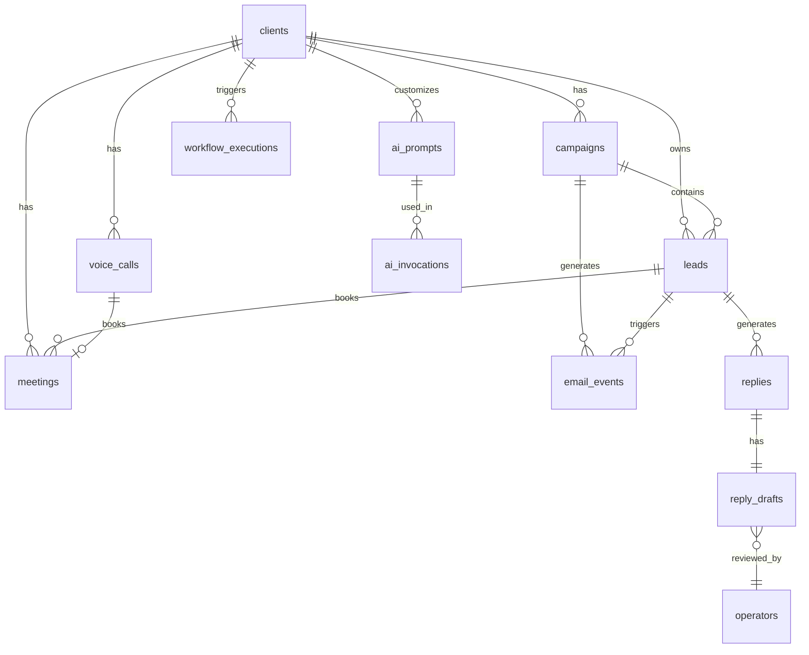
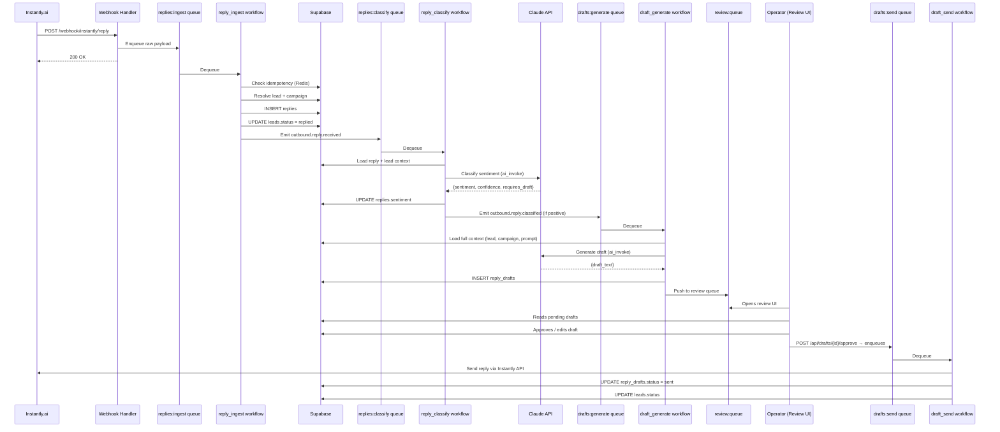
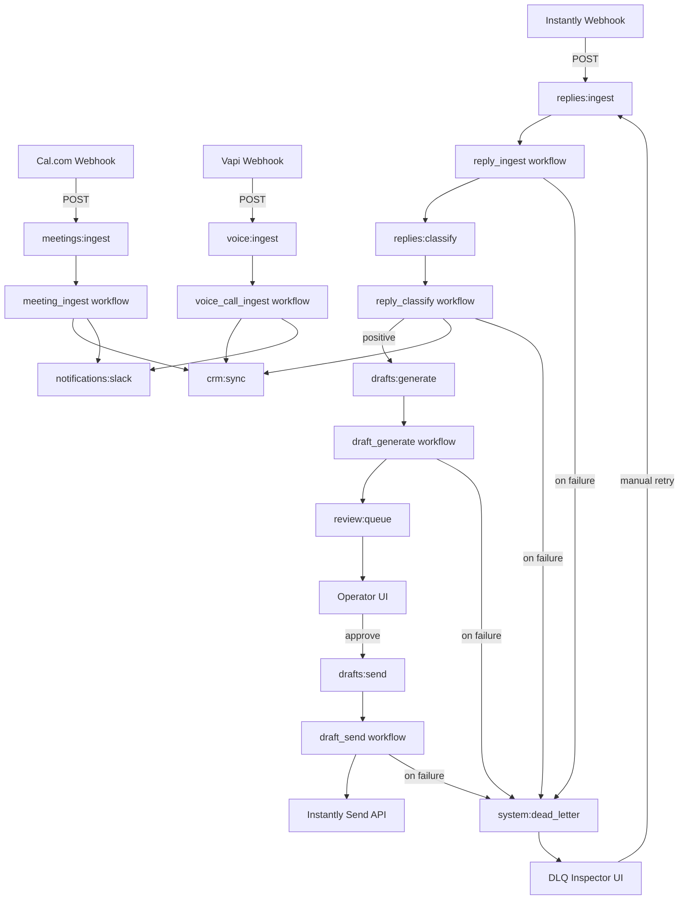
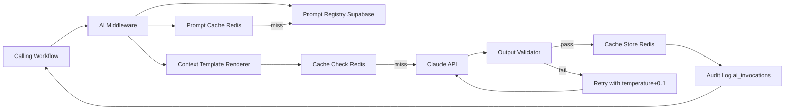
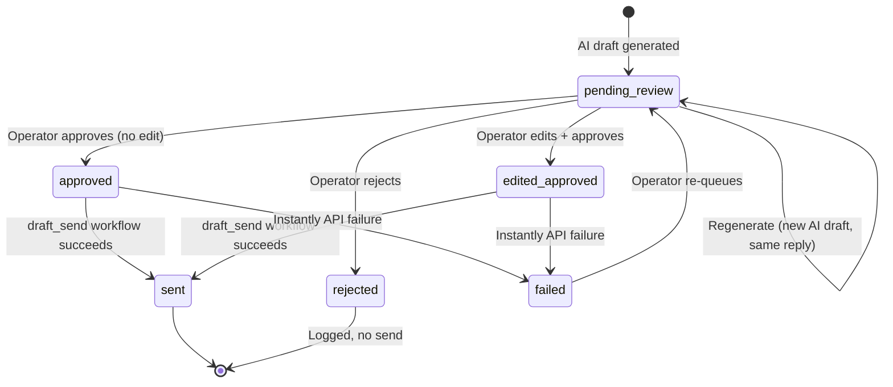
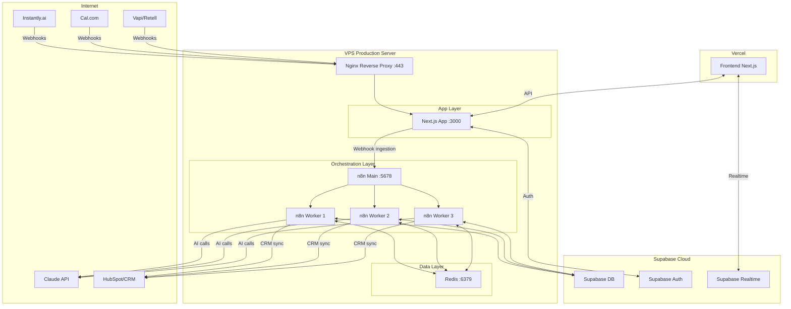
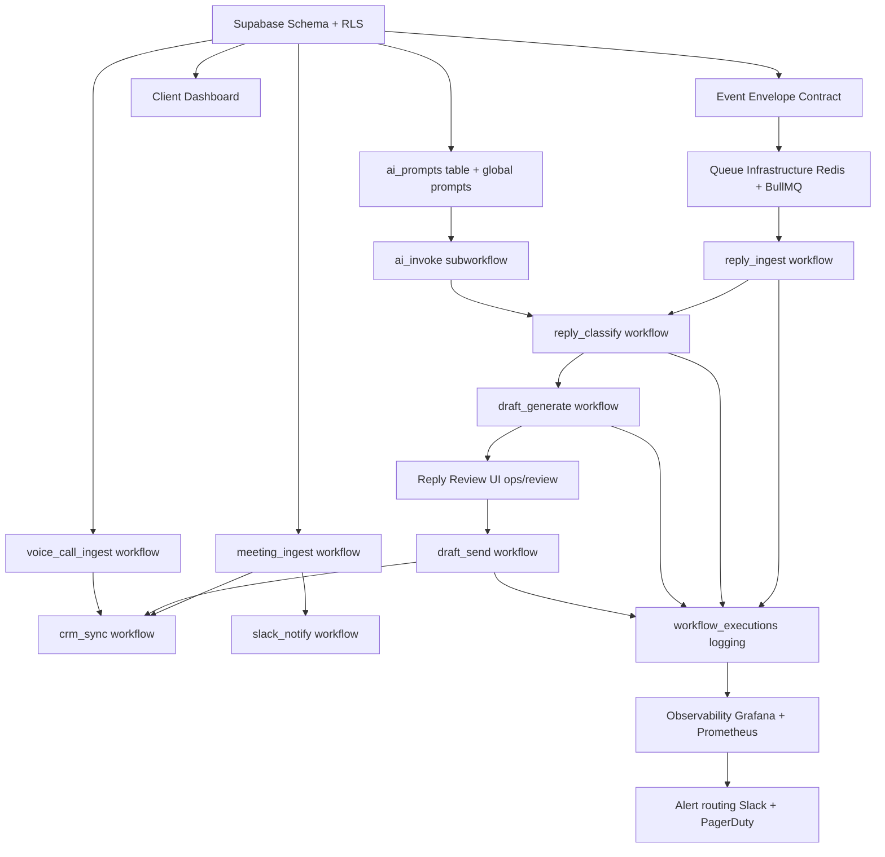

# KRIONICS OS — IMPLEMENTATION BLUEPRINT
**Version:** 1.0 | **Classification:** Internal Engineering — Confidential  
**Authors:** Engineering Team | **Status:** Implementation-Ready  
**Date:** May 2026

---

## DOCUMENT SCOPE

This document is the engineering implementation handbook for Krionics OS — the internal orchestration platform that manages multi-tenant client pipeline systems. It covers database contracts, event schemas, workflow specifications, queue architecture, AI pipeline design, frontend blueprints, observability, and deployment topology.

Architecture decisions are finalized. This document begins at implementation.

---

# SECTION 1 — DATABASE IMPLEMENTATION BLUEPRINT

## 1.1 Technology & Tenancy Model

**Database:** Supabase (PostgreSQL 15+)  
**Tenancy model:** Row-Level Security (RLS) per `client_id`  
**Source of truth:** Supabase for all persistent state  
**Ephemeral state:** Redis (queue jobs, locks, rate-limiting)  
**Audit:** Append-only `audit_log` table + Supabase Realtime for live ops

---

## 1.2 Enum Definitions

```sql
-- Client lifecycle
CREATE TYPE client_status AS ENUM (
  'onboarding', 'active', 'paused', 'churned', 'suspended'
);

-- Campaign state machine
CREATE TYPE campaign_status AS ENUM (
  'draft', 'warming', 'active', 'paused', 'completed', 'archived'
);

-- Lead interaction states
CREATE TYPE lead_status AS ENUM (
  'prospecting', 'contacted', 'replied', 'positive', 'negative',
  'meeting_booked', 'disqualified', 'unsubscribed'
);

-- Reply classification
CREATE TYPE reply_sentiment AS ENUM (
  'positive', 'negative', 'neutral', 'out_of_office', 'unsubscribe', 'unknown'
);

-- Draft review states
CREATE TYPE draft_status AS ENUM (
  'pending_review', 'approved', 'rejected', 'edited_approved', 'sent', 'failed'
);

-- Workflow execution states
CREATE TYPE execution_status AS ENUM (
  'queued', 'running', 'completed', 'failed', 'retrying', 'dead_lettered'
);

-- Meeting states
CREATE TYPE meeting_status AS ENUM (
  'scheduled', 'confirmed', 'cancelled', 'no_show', 'completed', 'rescheduled'
);

-- Service type
CREATE TYPE service_type AS ENUM ('cold_outbound', 'voice_agent', 'both');

-- AI invocation type
CREATE TYPE ai_invocation_type AS ENUM (
  'reply_classification', 'draft_generation', 'personalization',
  'sentiment_analysis', 'escalation_detection'
);

-- Voice call outcome
CREATE TYPE call_outcome AS ENUM (
  'meeting_booked', 'callback_requested', 'not_interested',
  'wrong_number', 'escalated', 'voicemail', 'completed'
);
```

---

## 1.3 Core Table Definitions

### Table: `clients`

**Purpose:** Master tenant registry. Every row-level security policy keys off `client_id`.

```sql
CREATE TABLE clients (
  id                UUID PRIMARY KEY DEFAULT gen_random_uuid(),
  slug              TEXT UNIQUE NOT NULL,              -- URL-safe identifier e.g. "acme-corp"
  company_name      TEXT NOT NULL,
  contact_email     TEXT NOT NULL,
  contact_name      TEXT NOT NULL,
  timezone          TEXT NOT NULL DEFAULT 'America/New_York',
  service_type      service_type NOT NULL,
  status            client_status NOT NULL DEFAULT 'onboarding',
  tier              TEXT NOT NULL,                    -- 'founding', 'growth', 'scale'
  mrr_usd           INTEGER NOT NULL DEFAULT 0,       -- in cents
  setup_fee_usd     INTEGER NOT NULL DEFAULT 0,       -- in cents
  contract_start    DATE,
  contract_end      DATE,
  config            JSONB NOT NULL DEFAULT '{}',      -- client-specific overrides
  crm_type          TEXT,                             -- 'hubspot', 'pipedrive', 'salesforce', 'ghl'
  crm_config        JSONB NOT NULL DEFAULT '{}',      -- encrypted credentials ref + field mappings
  slack_webhook_url TEXT,
  created_at        TIMESTAMPTZ NOT NULL DEFAULT NOW(),
  updated_at        TIMESTAMPTZ NOT NULL DEFAULT NOW()
);

CREATE INDEX idx_clients_status ON clients(status);
CREATE INDEX idx_clients_slug ON clients(slug);
```

**Read pattern:** Low-frequency, cached in Redis (TTL 5 min) per client.  
**Write pattern:** Krionics admin only. No client-side writes.  
**RLS:** Admin role only. No client portal access to this table.

---

### Table: `campaigns`

**Purpose:** Represents a cold outbound campaign for a client. Campaigns own sequences, inboxes, and leads.

```sql
CREATE TABLE campaigns (
  id                    UUID PRIMARY KEY DEFAULT gen_random_uuid(),
  client_id             UUID NOT NULL REFERENCES clients(id) ON DELETE CASCADE,
  name                  TEXT NOT NULL,
  status                campaign_status NOT NULL DEFAULT 'draft',
  instantly_campaign_id TEXT,                        -- external reference
  icp_config            JSONB NOT NULL DEFAULT '{}', -- filters, verticals, company size
  sequence_config       JSONB NOT NULL DEFAULT '{}', -- steps, delays, subject variants
  sending_config        JSONB NOT NULL DEFAULT '{}', -- inboxes, daily limits, send window
  personalization_prompt_id UUID,                   -- FK → ai_prompts
  total_leads           INTEGER NOT NULL DEFAULT 0,
  emails_sent           INTEGER NOT NULL DEFAULT 0,
  replies_received      INTEGER NOT NULL DEFAULT 0,
  positive_replies      INTEGER NOT NULL DEFAULT 0,
  meetings_booked       INTEGER NOT NULL DEFAULT 0,
  start_date            DATE,
  end_date              DATE,
  created_at            TIMESTAMPTZ NOT NULL DEFAULT NOW(),
  updated_at            TIMESTAMPTZ NOT NULL DEFAULT NOW()
);

CREATE INDEX idx_campaigns_client_id ON campaigns(client_id);
CREATE INDEX idx_campaigns_status ON campaigns(status);
CREATE INDEX idx_campaigns_client_status ON campaigns(client_id, status);
```

**Read pattern:** Dashboard queries per client; status-filtered on campaign list views.  
**Write pattern:** Moderate — status transitions, counter increments via trigger.  
**RLS:** `client_id = auth.jwt() -> 'client_id'`

---

### Table: `leads`

**Purpose:** Individual prospects associated with a campaign. Core entity for tracking outbound state.

```sql
CREATE TABLE leads (
  id                    UUID PRIMARY KEY DEFAULT gen_random_uuid(),
  client_id             UUID NOT NULL REFERENCES clients(id) ON DELETE CASCADE,
  campaign_id           UUID NOT NULL REFERENCES campaigns(id) ON DELETE CASCADE,
  email                 TEXT NOT NULL,
  first_name            TEXT,
  last_name             TEXT,
  company               TEXT,
  title                 TEXT,
  linkedin_url          TEXT,
  apollo_id             TEXT,
  clay_enrichment       JSONB NOT NULL DEFAULT '{}',   -- raw Clay output
  personalization_line  TEXT,                          -- AI-generated first line
  status                lead_status NOT NULL DEFAULT 'prospecting',
  instantly_lead_id     TEXT,                          -- external reference
  crm_contact_id        TEXT,                          -- CRM external reference
  last_contacted_at     TIMESTAMPTZ,
  replied_at            TIMESTAMPTZ,
  unsubscribed_at       TIMESTAMPTZ,
  meeting_booked_at     TIMESTAMPTZ,
  metadata              JSONB NOT NULL DEFAULT '{}',
  created_at            TIMESTAMPTZ NOT NULL DEFAULT NOW(),
  updated_at            TIMESTAMPTZ NOT NULL DEFAULT NOW()
);

CREATE INDEX idx_leads_client_id ON leads(client_id);
CREATE INDEX idx_leads_campaign_id ON leads(campaign_id);
CREATE INDEX idx_leads_status ON leads(status);
CREATE INDEX idx_leads_email ON leads(email);
CREATE INDEX idx_leads_campaign_status ON leads(campaign_id, status);
-- Partial index for active leads needing action
CREATE INDEX idx_leads_pending_review ON leads(client_id, replied_at)
  WHERE status IN ('replied', 'positive');
```

**Partitioning:** Partition by `client_id` when any single client exceeds 50K leads.  
**Read pattern:** Heavy — dashboard filters, reply queue population, export.  
**Write pattern:** High — status updates, enrichment writes, meeting timestamp.

---

### Table: `email_events`

**Purpose:** Immutable event log for every email interaction. Never updated — append only.

```sql
CREATE TABLE email_events (
  id            UUID PRIMARY KEY DEFAULT gen_random_uuid(),
  client_id     UUID NOT NULL REFERENCES clients(id) ON DELETE CASCADE,
  campaign_id   UUID NOT NULL REFERENCES campaigns(id) ON DELETE CASCADE,
  lead_id       UUID NOT NULL REFERENCES leads(id) ON DELETE CASCADE,
  event_type    TEXT NOT NULL,  -- 'sent', 'opened', 'clicked', 'replied', 'bounced', 'unsubscribed'
  inbox_email   TEXT,
  subject       TEXT,
  body_snippet  TEXT,           -- first 500 chars, no PII in full body
  metadata      JSONB NOT NULL DEFAULT '{}',
  occurred_at   TIMESTAMPTZ NOT NULL DEFAULT NOW(),
  source        TEXT NOT NULL DEFAULT 'instantly'
) PARTITION BY RANGE (occurred_at);

-- Monthly partitions
CREATE TABLE email_events_2026_05 PARTITION OF email_events
  FOR VALUES FROM ('2026-05-01') TO ('2026-06-01');
CREATE TABLE email_events_2026_06 PARTITION OF email_events
  FOR VALUES FROM ('2026-06-01') TO ('2026-07-01');
-- Create 12-month forward partitions via migration script

CREATE INDEX idx_email_events_client ON email_events(client_id, occurred_at DESC);
CREATE INDEX idx_email_events_lead ON email_events(lead_id, occurred_at DESC);
CREATE INDEX idx_email_events_campaign ON email_events(campaign_id, event_type);
```

**Retention:** 24 months. Archive to cold storage after 12 months via pg_partman.  
**Write pattern:** Very high — every Instantly webhook fires an insert.  
**Read pattern:** Analytics aggregation. Never row-by-row reads.

---

### Table: `replies`

**Purpose:** Enriched reply records. Created when Instantly fires a reply webhook. Links to draft generation.

```sql
CREATE TABLE replies (
  id                  UUID PRIMARY KEY DEFAULT gen_random_uuid(),
  client_id           UUID NOT NULL REFERENCES clients(id) ON DELETE CASCADE,
  lead_id             UUID NOT NULL REFERENCES leads(id) ON DELETE CASCADE,
  campaign_id         UUID NOT NULL REFERENCES campaigns(id) ON DELETE CASCADE,
  instantly_reply_id  TEXT UNIQUE,
  subject             TEXT,
  body                TEXT NOT NULL,
  from_email          TEXT NOT NULL,
  received_at         TIMESTAMPTZ NOT NULL,
  sentiment           reply_sentiment NOT NULL DEFAULT 'unknown',
  ai_classification   JSONB,                    -- raw AI output from classification
  classification_confidence NUMERIC(4,3),      -- 0.000 to 1.000
  requires_review     BOOLEAN NOT NULL DEFAULT TRUE,
  reviewed_at         TIMESTAMPTZ,
  reviewed_by         UUID,                     -- FK → operators
  crm_synced          BOOLEAN NOT NULL DEFAULT FALSE,
  crm_synced_at       TIMESTAMPTZ,
  trace_id            UUID,
  created_at          TIMESTAMPTZ NOT NULL DEFAULT NOW()
);

CREATE INDEX idx_replies_client_review ON replies(client_id, requires_review, received_at DESC);
CREATE INDEX idx_replies_lead ON replies(lead_id);
CREATE INDEX idx_replies_campaign ON replies(campaign_id);
CREATE INDEX idx_replies_sentiment ON replies(sentiment, received_at DESC);
-- Review queue index
CREATE INDEX idx_replies_pending ON replies(client_id, received_at DESC)
  WHERE requires_review = TRUE AND reviewed_at IS NULL;
```

---

### Table: `reply_drafts`

**Purpose:** AI-generated reply drafts awaiting human review and approval.

```sql
CREATE TABLE reply_drafts (
  id              UUID PRIMARY KEY DEFAULT gen_random_uuid(),
  client_id       UUID NOT NULL REFERENCES clients(id) ON DELETE CASCADE,
  reply_id        UUID NOT NULL REFERENCES replies(id) ON DELETE CASCADE,
  lead_id         UUID NOT NULL REFERENCES leads(id) ON DELETE CASCADE,
  status          draft_status NOT NULL DEFAULT 'pending_review',
  ai_draft        TEXT NOT NULL,               -- original AI-generated text
  edited_draft    TEXT,                        -- operator-edited version
  sent_draft      TEXT,                        -- final sent version (may differ from edited)
  prompt_version  TEXT,                        -- which prompt generated this
  ai_metadata     JSONB NOT NULL DEFAULT '{}', -- tokens used, model, latency
  operator_id     UUID,                        -- who reviewed
  reviewed_at     TIMESTAMPTZ,
  approved_at     TIMESTAMPTZ,
  sent_at         TIMESTAMPTZ,
  rejection_reason TEXT,
  edit_diff       JSONB,                       -- structured diff of operator edits
  sla_deadline    TIMESTAMPTZ,                 -- auto-computed: received_at + client SLA config
  trace_id        UUID NOT NULL,
  created_at      TIMESTAMPTZ NOT NULL DEFAULT NOW(),
  updated_at      TIMESTAMPTZ NOT NULL DEFAULT NOW()
);

CREATE INDEX idx_drafts_client_status ON reply_drafts(client_id, status, created_at DESC);
CREATE INDEX idx_drafts_reply ON reply_drafts(reply_id);
CREATE INDEX idx_drafts_sla ON reply_drafts(sla_deadline)
  WHERE status = 'pending_review';
-- Operator queue view
CREATE INDEX idx_drafts_pending ON reply_drafts(client_id, sla_deadline ASC)
  WHERE status = 'pending_review';
```

---

### Table: `meetings`

**Purpose:** Booked meetings from Cal.com/Calendly webhooks or voice agent bookings.

```sql
CREATE TABLE meetings (
  id                  UUID PRIMARY KEY DEFAULT gen_random_uuid(),
  client_id           UUID NOT NULL REFERENCES clients(id) ON DELETE CASCADE,
  lead_id             UUID REFERENCES leads(id),
  campaign_id         UUID REFERENCES campaigns(id),
  voice_call_id       UUID REFERENCES voice_calls(id),
  calendly_event_id   TEXT,
  cal_booking_id      TEXT,
  status              meeting_status NOT NULL DEFAULT 'scheduled',
  scheduled_at        TIMESTAMPTZ NOT NULL,
  duration_minutes    INTEGER NOT NULL DEFAULT 30,
  attendee_email      TEXT NOT NULL,
  attendee_name       TEXT,
  attendee_company    TEXT,
  meeting_type        TEXT,                        -- 'discovery', 'demo', 'qualification'
  source              TEXT NOT NULL,               -- 'cold_email', 'voice_agent', 'inbound'
  crm_deal_id         TEXT,
  crm_synced          BOOLEAN NOT NULL DEFAULT FALSE,
  cancelled_at        TIMESTAMPTZ,
  cancellation_reason TEXT,
  completed_at        TIMESTAMPTZ,
  notes               TEXT,
  metadata            JSONB NOT NULL DEFAULT '{}',
  created_at          TIMESTAMPTZ NOT NULL DEFAULT NOW(),
  updated_at          TIMESTAMPTZ NOT NULL DEFAULT NOW()
);

CREATE INDEX idx_meetings_client ON meetings(client_id, scheduled_at DESC);
CREATE INDEX idx_meetings_lead ON meetings(lead_id);
CREATE INDEX idx_meetings_status ON meetings(status, scheduled_at);
```

---

### Table: `voice_calls`

**Purpose:** Records of all Vapi/Retell voice agent interactions.

```sql
CREATE TABLE voice_calls (
  id                UUID PRIMARY KEY DEFAULT gen_random_uuid(),
  client_id         UUID NOT NULL REFERENCES clients(id) ON DELETE CASCADE,
  vapi_call_id      TEXT UNIQUE,
  retell_call_id    TEXT UNIQUE,
  phone_number      TEXT NOT NULL,
  caller_name       TEXT,
  caller_company    TEXT,
  direction         TEXT NOT NULL,           -- 'inbound', 'outbound'
  outcome           call_outcome,
  duration_seconds  INTEGER,
  started_at        TIMESTAMPTZ NOT NULL,
  ended_at          TIMESTAMPTZ,
  transcript        TEXT,
  summary           TEXT,                   -- AI-generated post-call summary
  recording_url     TEXT,
  agent_id          TEXT,                   -- which voice agent config handled this
  crm_contact_id    TEXT,
  crm_synced        BOOLEAN NOT NULL DEFAULT FALSE,
  meeting_booked    BOOLEAN NOT NULL DEFAULT FALSE,
  escalated         BOOLEAN NOT NULL DEFAULT FALSE,
  flagged_for_review BOOLEAN NOT NULL DEFAULT FALSE,
  metadata          JSONB NOT NULL DEFAULT '{}',
  created_at        TIMESTAMPTZ NOT NULL DEFAULT NOW()
);

CREATE INDEX idx_voice_calls_client ON voice_calls(client_id, started_at DESC);
CREATE INDEX idx_voice_calls_outcome ON voice_calls(outcome, started_at DESC);
CREATE INDEX idx_voice_calls_flagged ON voice_calls(client_id)
  WHERE flagged_for_review = TRUE;
```

---

### Table: `ai_prompts`

**Purpose:** Versioned prompt registry. All AI invocations reference a prompt record by ID and version.

```sql
CREATE TABLE ai_prompts (
  id            UUID PRIMARY KEY DEFAULT gen_random_uuid(),
  client_id     UUID REFERENCES clients(id) ON DELETE CASCADE,  -- NULL = global/shared
  name          TEXT NOT NULL,
  slug          TEXT NOT NULL,                    -- e.g. 'reply-draft-v2', 'classify-reply-v1'
  version       INTEGER NOT NULL DEFAULT 1,
  invocation_type ai_invocation_type NOT NULL,
  system_prompt TEXT NOT NULL,
  user_template TEXT NOT NULL,                    -- Handlebars/Jinja template
  model         TEXT NOT NULL DEFAULT 'claude-sonnet-4-20250514',
  max_tokens    INTEGER NOT NULL DEFAULT 1000,
  temperature   NUMERIC(3,2) NOT NULL DEFAULT 0.3,
  is_active     BOOLEAN NOT NULL DEFAULT TRUE,
  is_global     BOOLEAN NOT NULL DEFAULT FALSE,
  test_cases    JSONB NOT NULL DEFAULT '[]',      -- regression test inputs/outputs
  created_by    UUID,
  created_at    TIMESTAMPTZ NOT NULL DEFAULT NOW(),
  UNIQUE(slug, version, client_id)
);

CREATE INDEX idx_prompts_slug ON ai_prompts(slug, is_active);
CREATE INDEX idx_prompts_client ON ai_prompts(client_id, invocation_type);
CREATE INDEX idx_prompts_global ON ai_prompts(invocation_type)
  WHERE is_global = TRUE AND is_active = TRUE;
```

---

### Table: `ai_invocations`

**Purpose:** Audit log for every Claude API call. Supports cost tracking, debugging, and performance analysis.

```sql
CREATE TABLE ai_invocations (
  id              UUID PRIMARY KEY DEFAULT gen_random_uuid(),
  client_id       UUID REFERENCES clients(id),
  prompt_id       UUID REFERENCES ai_prompts(id),
  prompt_version  INTEGER NOT NULL,
  invocation_type ai_invocation_type NOT NULL,
  trace_id        UUID NOT NULL,
  entity_type     TEXT,                         -- 'reply', 'lead', 'campaign'
  entity_id       UUID,
  model           TEXT NOT NULL,
  input_tokens    INTEGER,
  output_tokens   INTEGER,
  latency_ms      INTEGER,
  input_hash      TEXT,                         -- SHA-256 of input for cache key
  cached          BOOLEAN NOT NULL DEFAULT FALSE,
  success         BOOLEAN NOT NULL DEFAULT TRUE,
  error_code      TEXT,
  raw_output      JSONB,
  validated_output JSONB,
  validation_passed BOOLEAN,
  cost_usd_micro  INTEGER,                      -- cost in micro-dollars ($0.000001 units)
  invoked_at      TIMESTAMPTZ NOT NULL DEFAULT NOW()
) PARTITION BY RANGE (invoked_at);

CREATE TABLE ai_invocations_2026_05 PARTITION OF ai_invocations
  FOR VALUES FROM ('2026-05-01') TO ('2026-06-01');

CREATE INDEX idx_ai_inv_trace ON ai_invocations(trace_id);
CREATE INDEX idx_ai_inv_client ON ai_invocations(client_id, invoked_at DESC);
CREATE INDEX idx_ai_inv_type ON ai_invocations(invocation_type, invoked_at DESC);
```

---

### Table: `workflow_executions`

**Purpose:** Tracks every n8n workflow execution. Source of truth for observability and retry management.

```sql
CREATE TABLE workflow_executions (
  id                  UUID PRIMARY KEY DEFAULT gen_random_uuid(),
  workflow_name       TEXT NOT NULL,
  workflow_version    TEXT,
  client_id           UUID REFERENCES clients(id),
  trace_id            UUID NOT NULL,
  trigger_event       TEXT,
  trigger_entity_id   UUID,
  status              execution_status NOT NULL DEFAULT 'queued',
  queue_name          TEXT NOT NULL,
  attempt_number      INTEGER NOT NULL DEFAULT 1,
  max_attempts        INTEGER NOT NULL DEFAULT 3,
  started_at          TIMESTAMPTZ,
  completed_at        TIMESTAMPTZ,
  duration_ms         INTEGER,
  error_message       TEXT,
  error_stack         TEXT,
  input_payload       JSONB,
  output_payload      JSONB,
  emitted_events      JSONB DEFAULT '[]',
  db_reads            INTEGER DEFAULT 0,
  db_writes           INTEGER DEFAULT 0,
  created_at          TIMESTAMPTZ NOT NULL DEFAULT NOW()
) PARTITION BY RANGE (created_at);

CREATE INDEX idx_exec_trace ON workflow_executions(trace_id);
CREATE INDEX idx_exec_client_status ON workflow_executions(client_id, status, created_at DESC);
CREATE INDEX idx_exec_workflow ON workflow_executions(workflow_name, status);
CREATE INDEX idx_exec_failed ON workflow_executions(client_id, created_at DESC)
  WHERE status IN ('failed', 'dead_lettered');
```

---

### Table: `audit_log`

**Purpose:** Immutable audit trail for all state-changing operations. Append-only.

```sql
CREATE TABLE audit_log (
  id          BIGSERIAL PRIMARY KEY,
  client_id   UUID REFERENCES clients(id),
  actor_type  TEXT NOT NULL,              -- 'operator', 'system', 'workflow', 'ai'
  actor_id    TEXT,
  action      TEXT NOT NULL,             -- e.g. 'draft.approved', 'lead.status_changed'
  entity_type TEXT NOT NULL,
  entity_id   UUID NOT NULL,
  before_state JSONB,
  after_state  JSONB,
  metadata     JSONB NOT NULL DEFAULT '{}',
  trace_id     UUID,
  occurred_at  TIMESTAMPTZ NOT NULL DEFAULT NOW()
) PARTITION BY RANGE (occurred_at);

CREATE INDEX idx_audit_client ON audit_log(client_id, occurred_at DESC);
CREATE INDEX idx_audit_entity ON audit_log(entity_type, entity_id, occurred_at DESC);
```

---

### Table: `operators`

**Purpose:** Krionics internal team members who interact with the review system.

```sql
CREATE TABLE operators (
  id          UUID PRIMARY KEY DEFAULT gen_random_uuid(),
  email       TEXT UNIQUE NOT NULL,
  name        TEXT NOT NULL,
  role        TEXT NOT NULL DEFAULT 'reviewer',  -- 'admin', 'reviewer', 'viewer'
  is_active   BOOLEAN NOT NULL DEFAULT TRUE,
  client_access UUID[],                           -- NULL = all clients
  created_at  TIMESTAMPTZ NOT NULL DEFAULT NOW()
);
```

---

## 1.4 Row-Level Security Policies

```sql
-- Enable RLS on all client-scoped tables
ALTER TABLE campaigns ENABLE ROW LEVEL SECURITY;
ALTER TABLE leads ENABLE ROW LEVEL SECURITY;
ALTER TABLE replies ENABLE ROW LEVEL SECURITY;
ALTER TABLE reply_drafts ENABLE ROW LEVEL SECURITY;
ALTER TABLE meetings ENABLE ROW LEVEL SECURITY;
ALTER TABLE voice_calls ENABLE ROW LEVEL SECURITY;
ALTER TABLE email_events ENABLE ROW LEVEL SECURITY;

-- Client portal policy (future use)
CREATE POLICY client_isolation ON campaigns
  FOR ALL TO authenticated
  USING (client_id = (auth.jwt() ->> 'client_id')::UUID);

-- Operator policy: full access to assigned clients
CREATE POLICY operator_access ON campaigns
  FOR ALL TO authenticated
  USING (
    (auth.jwt() ->> 'role') = 'operator'
    AND (
      (auth.jwt() ->> 'client_access') IS NULL  -- NULL = all clients
      OR client_id = ANY(
        (SELECT client_access FROM operators WHERE id = (auth.jwt() ->> 'sub')::UUID)
      )
    )
  );

-- Service role bypasses RLS (used by n8n workflows)
-- Service role key is never exposed to frontend
```

---

## 1.5 Counter Triggers

```sql
-- Increment campaign counters on email_events insert
CREATE OR REPLACE FUNCTION update_campaign_counters()
RETURNS TRIGGER AS $$
BEGIN
  IF NEW.event_type = 'sent' THEN
    UPDATE campaigns SET emails_sent = emails_sent + 1 WHERE id = NEW.campaign_id;
  ELSIF NEW.event_type = 'replied' THEN
    UPDATE campaigns SET replies_received = replies_received + 1 WHERE id = NEW.campaign_id;
  END IF;
  RETURN NEW;
END;
$$ LANGUAGE plpgsql;

CREATE TRIGGER trg_email_event_counters
  AFTER INSERT ON email_events
  FOR EACH ROW EXECUTE FUNCTION update_campaign_counters();

-- Auto-update updated_at
CREATE OR REPLACE FUNCTION set_updated_at()
RETURNS TRIGGER AS $$
BEGIN
  NEW.updated_at = NOW();
  RETURN NEW;
END;
$$ LANGUAGE plpgsql;

-- Apply to all mutable tables
CREATE TRIGGER trg_clients_updated_at BEFORE UPDATE ON clients
  FOR EACH ROW EXECUTE FUNCTION set_updated_at();
CREATE TRIGGER trg_campaigns_updated_at BEFORE UPDATE ON campaigns
  FOR EACH ROW EXECUTE FUNCTION set_updated_at();
CREATE TRIGGER trg_leads_updated_at BEFORE UPDATE ON leads
  FOR EACH ROW EXECUTE FUNCTION set_updated_at();
CREATE TRIGGER trg_reply_drafts_updated_at BEFORE UPDATE ON reply_drafts
  FOR EACH ROW EXECUTE FUNCTION set_updated_at();
```

---

## 1.6 JSONB Usage Strategy

| Table | Field | Contents | Access Pattern |
|-------|-------|----------|----------------|
| `clients` | `config` | SLA hours, review thresholds, approved sender list | Read on workflow start |
| `clients` | `crm_config` | Field mappings, webhook secrets, auth token refs | Read on CRM sync |
| `campaigns` | `icp_config` | Vertical, company size, title filters | Read by lead builder |
| `campaigns` | `sequence_config` | Email steps, delays, A/B variants | Read by Instantly sync |
| `leads` | `clay_enrichment` | Raw Clay JSON: email sources, confidence, LinkedIn | Read by AI pipeline |
| `ai_invocations` | `raw_output` | Full Claude response for debugging | Rarely read, stored for audit |
| `workflow_executions` | `input_payload` | Snapshot of event payload at execution time | Debug reads |

**Rule:** Never query inside JSONB fields in hot paths. Materialize as columns if queried >100×/min.

---

## 1.7 ER Diagram



---

# SECTION 2 — EVENT CONTRACT BLUEPRINT

## 2.1 Event Naming Conventions

```
{domain}.{entity}.{action}[.{qualifier}]

Examples:
  outbound.reply.received
  outbound.draft.approved
  outbound.draft.rejected
  meeting.booked
  meeting.cancelled
  voice.call.completed
  voice.call.escalated
  system.workflow.failed
  crm.contact.synced
```

**Domains:** `outbound` | `meeting` | `voice` | `crm` | `system` | `ai`

---

## 2.2 Base Event Envelope

Every event MUST conform to this envelope:

```json
{
  "event_id": "uuid-v4",
  "event_type": "outbound.reply.received",
  "event_version": "1.0",
  "client_id": "uuid",
  "trace_id": "uuid",
  "timestamp": "2026-05-18T10:30:00.000Z",
  "producer": "workflow.reply_ingest",
  "idempotency_key": "instantly:{reply_id}",
  "payload": {},
  "metadata": {
    "retry_count": 0,
    "source_queue": "replies:ingest",
    "schema_version": "1.0"
  }
}
```

**`trace_id`:** Propagated across all child workflows and AI invocations spawned by this event.  
**`idempotency_key`:** Checked against Redis SET with 24h TTL before processing.  
**`event_version`:** Increment minor on field additions; major on breaking changes.

---

## 2.3 Event Contracts

### Event: `outbound.reply.received`

**Producer:** `reply_ingest` workflow (triggered by Instantly webhook)  
**Consumers:** `reply_classifier`, `crm_sync`, `dashboard_update`

```json
{
  "event_id": "uuid",
  "event_type": "outbound.reply.received",
  "event_version": "1.0",
  "client_id": "uuid",
  "trace_id": "uuid",
  "timestamp": "ISO8601",
  "producer": "workflow.reply_ingest",
  "idempotency_key": "instantly:{instantly_reply_id}",
  "payload": {
    "reply_id": "uuid",
    "lead_id": "uuid",
    "campaign_id": "uuid",
    "instantly_reply_id": "string",
    "from_email": "string",
    "subject": "string",
    "body": "string",
    "received_at": "ISO8601"
  },
  "metadata": {
    "retry_count": 0,
    "source_queue": "replies:ingest",
    "schema_version": "1.0"
  }
}
```

**Retry implications:** Safe to retry. Idempotency key prevents duplicate reply records.  
**TTL:** Event is stale after 1 hour. Discard if received after TTL.

---

### Event: `outbound.reply.classified`

**Producer:** `reply_classifier` workflow  
**Consumers:** `draft_generator`, `crm_sync`, `lead_status_updater`

```json
{
  "event_type": "outbound.reply.classified",
  "payload": {
    "reply_id": "uuid",
    "lead_id": "uuid",
    "campaign_id": "uuid",
    "sentiment": "positive|negative|neutral|out_of_office|unsubscribe",
    "confidence": 0.94,
    "classification_reasoning": "string",
    "requires_draft": true,
    "requires_unsubscribe": false,
    "ai_invocation_id": "uuid"
  }
}
```

---

### Event: `outbound.draft.generated`

**Producer:** `draft_generator` workflow  
**Consumers:** `review_queue_manager`

```json
{
  "event_type": "outbound.draft.generated",
  "payload": {
    "draft_id": "uuid",
    "reply_id": "uuid",
    "lead_id": "uuid",
    "client_id": "uuid",
    "draft_text": "string",
    "sla_deadline": "ISO8601",
    "priority": "high|normal|low",
    "ai_invocation_id": "uuid",
    "prompt_version": "reply-draft-v2"
  }
}
```

---

### Event: `outbound.draft.approved`

**Producer:** Review UI → API → workflow  
**Consumers:** `email_sender`, `crm_sync`, `audit_writer`

```json
{
  "event_type": "outbound.draft.approved",
  "payload": {
    "draft_id": "uuid",
    "reply_id": "uuid",
    "lead_id": "uuid",
    "final_text": "string",
    "was_edited": true,
    "operator_id": "uuid",
    "approved_at": "ISO8601"
  }
}
```

---

### Event: `meeting.booked`

**Producer:** `meeting_ingest` workflow (Cal.com/Calendly webhook)  
**Consumers:** `crm_sync`, `slack_notifier`, `lead_status_updater`, `dashboard_update`

```json
{
  "event_type": "meeting.booked",
  "payload": {
    "meeting_id": "uuid",
    "client_id": "uuid",
    "lead_id": "uuid",
    "campaign_id": "uuid",
    "attendee_email": "string",
    "attendee_name": "string",
    "attendee_company": "string",
    "scheduled_at": "ISO8601",
    "duration_minutes": 30,
    "meeting_type": "discovery",
    "source": "cold_email|voice_agent|inbound",
    "booking_platform": "cal|calendly",
    "external_booking_id": "string"
  }
}
```

---

### Event: `voice.call.completed`

**Producer:** `voice_call_ingest` workflow (Vapi/Retell webhook)  
**Consumers:** `crm_sync`, `slack_notifier`, `meeting_creator` (if booked), `transcript_processor`

```json
{
  "event_type": "voice.call.completed",
  "payload": {
    "voice_call_id": "uuid",
    "client_id": "uuid",
    "vapi_call_id": "string",
    "phone_number": "string",
    "direction": "inbound|outbound",
    "outcome": "meeting_booked|callback_requested|not_interested|escalated|voicemail",
    "duration_seconds": 147,
    "transcript": "string",
    "summary": "string",
    "recording_url": "string",
    "meeting_booked": false,
    "escalated": false,
    "caller_name": "string",
    "caller_company": "string"
  }
}
```

---

### Event: `system.workflow.failed`

**Producer:** Any failed workflow  
**Consumers:** `dead_letter_handler`, `alert_router`

```json
{
  "event_type": "system.workflow.failed",
  "payload": {
    "workflow_name": "string",
    "execution_id": "uuid",
    "client_id": "uuid",
    "trace_id": "uuid",
    "attempt_number": 3,
    "error_message": "string",
    "error_code": "TIMEOUT|DB_ERROR|AI_ERROR|EXTERNAL_API",
    "input_payload": {},
    "queue_name": "string"
  }
}
```

---

## 2.4 Event Versioning Strategy

- **Minor version** (1.0 → 1.1): Add optional fields. Consumer must tolerate unknown fields.
- **Major version** (1.0 → 2.0): Breaking schema change. Run both consumers in parallel during migration. Dual-emit from producer for 2 weeks. Retire v1 consumer after validation.
- **Version registry:** All event schemas stored in `event_schemas` directory in the repo. JSON Schema validation at producer.

---

# SECTION 3 — WORKFLOW IMPLEMENTATION BLUEPRINT

## 3.1 Workflow Naming Conventions

```
Format: {domain}_{action}[_{qualifier}]

Examples:
  reply_ingest
  reply_classify
  draft_generate
  draft_send
  meeting_ingest
  crm_sync_contact
  voice_call_ingest
  slack_notify
  lead_status_update
  dead_letter_handle
```

## 3.2 n8n Folder Organization

```
/workflows
  /ingest
    reply_ingest.json
    meeting_ingest.json
    voice_call_ingest.json
    email_event_ingest.json
  /classification
    reply_classify.json
  /generation
    draft_generate.json
    personalization_generate.json
  /review
    review_queue_manage.json
    draft_send.json
  /sync
    crm_sync_contact.json
    crm_sync_meeting.json
    lead_status_update.json
  /notification
    slack_notify.json
    sla_alert.json
  /infrastructure
    dead_letter_handle.json
    retry_manager.json
    queue_health_check.json
  /subworkflows
    ai_invoke.json
    db_read_lead.json
    db_write_execution.json
    idempotency_check.json
    trace_propagate.json
```

---

## 3.3 Workflow Specifications

---

### Workflow: `reply_ingest`

| Field | Value |
|-------|-------|
| **Trigger** | HTTP POST webhook from Instantly.ai |
| **Queue** | `replies:ingest` (priority: high) |
| **Execution mode** | Async |
| **Expected time** | < 500ms |
| **Idempotency key** | `instantly:{instantly_reply_id}` |

**Steps:**
1. Receive Instantly webhook payload
2. Validate HMAC signature (secret from `clients.config.instantly_webhook_secret`)
3. Check idempotency key in Redis (SETNX with 24h TTL) → if exists, return 200 and exit
4. Resolve `client_id` from `instantly_campaign_id` (Redis cache → DB fallback)
5. Resolve `lead_id` from `from_email` + `campaign_id`
6. Insert row into `replies` table
7. Insert row into `email_events` (event_type: 'replied')
8. Update `leads.status` = 'replied', `leads.replied_at` = NOW()
9. Emit event: `outbound.reply.received` → push to `replies:classify` queue
10. Return 200 to Instantly

**DB reads:** `clients` (cached), `leads` (by email + campaign_id)  
**DB writes:** `replies` (insert), `email_events` (insert), `leads` (update)  
**Emits:** `outbound.reply.received`  
**Failure behavior:** Return 500 to Instantly. Instantly will retry (3 attempts, exponential).  
**Retry policy:** No internal retry. Rely on Instantly webhook retry.

---

### Workflow: `reply_classify`

| Field | Value |
|-------|-------|
| **Trigger** | Message from `replies:classify` queue |
| **Queue** | `replies:classify` (priority: high) |
| **Consumed event** | `outbound.reply.received` |
| **Execution mode** | Async |
| **Expected time** | < 3s |

**Steps:**
1. Dequeue message from `replies:classify`
2. Check idempotency key: `classify:{reply_id}` (Redis)
3. Load `replies` row (body, subject, from_email)
4. Load `leads` row (name, company, campaign context)
5. Load `clients` config (sentiment thresholds, language config)
6. Invoke AI subworkflow: `ai_invoke` with `invocation_type: reply_classification`
7. Parse AI output → extract `sentiment`, `confidence`, `requires_draft`, `requires_unsubscribe`
8. Validate: confidence ≥ 0.7 OR flag for human review
9. Update `replies` row: `sentiment`, `ai_classification`, `classification_confidence`
10. If `requires_unsubscribe`: trigger `unsubscribe_handler` subworkflow
11. If `requires_draft` AND sentiment is `positive|neutral`: push to `drafts:generate` queue
12. Emit `outbound.reply.classified` event
13. Log execution to `workflow_executions`

**DB reads:** `replies`, `leads`, `clients.config`  
**DB writes:** `replies` (update sentiment fields)  
**Emits:** `outbound.reply.classified`  
**Retry policy:** 3 attempts, exponential backoff (2s, 8s, 32s). Dead-letter after 3 failures.

---

### Workflow: `draft_generate`

| Field | Value |
|-------|-------|
| **Trigger** | Message from `drafts:generate` queue |
| **Consumed event** | `outbound.reply.classified` |
| **Queue** | `drafts:generate` (priority: high) |
| **Execution mode** | Async |
| **Expected time** | < 5s |

**Steps:**
1. Dequeue from `drafts:generate`
2. Check idempotency key: `draft:{reply_id}` (Redis)
3. Load `replies` row (body, sentiment, classification)
4. Load `leads` row (full enrichment context)
5. Load `campaigns` row (sequence_config, personalization style)
6. Load client-specific prompt or fall back to global prompt (by slug: `reply-draft`, latest active version)
7. Build context object for prompt template: `{lead, reply, campaign, client_tone_config}`
8. Invoke AI subworkflow: `ai_invoke` with `invocation_type: draft_generation`
9. Validate AI output (non-empty, length check, no hallucinated names)
10. Compute `sla_deadline` = NOW() + `clients.config.reply_sla_hours` (default: 4h)
11. Insert `reply_drafts` row: `ai_draft`, `status: pending_review`, `sla_deadline`, `trace_id`
12. Emit `outbound.draft.generated` → push to `review:queue` 
13. Log execution

**DB reads:** `replies`, `leads`, `campaigns`, `ai_prompts`, `clients.config`  
**DB writes:** `reply_drafts` (insert)  
**Emits:** `outbound.draft.generated`  
**External integrations:** Claude API (via `ai_invoke` subworkflow)  
**Retry policy:** 3 attempts. AI timeout = 10s. Retry on timeout or 500.

---

### Workflow: `draft_send`

| Field | Value |
|-------|-------|
| **Trigger** | Operator approves draft via Review UI → API emits `outbound.draft.approved` |
| **Queue** | `drafts:send` (priority: critical) |
| **Consumed event** | `outbound.draft.approved` |
| **Execution mode** | Async |
| **Expected time** | < 2s |

**Steps:**
1. Dequeue from `drafts:send`
2. Load `reply_drafts` row. Validate status = `approved`.
3. Load `leads` row (email, campaign context)
4. Load `clients.config` (sending inbox assignment)
5. Send reply via Instantly API (reply-to-thread endpoint)
6. On success: update `reply_drafts.status` = `sent`, `reply_drafts.sent_at` = NOW(), `reply_drafts.sent_draft` = final text
7. Update `leads.status` based on sentiment (positive → keep; neutral → keep)
8. Push to `crm:sync` queue with entity type `reply_sent`
9. Log to `audit_log`

**DB reads:** `reply_drafts`, `leads`, `clients.config`  
**DB writes:** `reply_drafts` (status update)  
**External integrations:** Instantly API  
**Retry policy:** 3 attempts. If Instantly fails 3 times: status → `failed`, alert operator.

---

### Workflow: `meeting_ingest`

| Field | Value |
|-------|-------|
| **Trigger** | HTTP POST webhook from Cal.com or Calendly |
| **Queue** | `meetings:ingest` (priority: high) |
| **Execution mode** | Async |
| **Expected time** | < 500ms |

**Steps:**
1. Validate webhook signature (Cal.com: `x-cal-signature-256`; Calendly: `svix-signature`)
2. Normalize payload to internal `MeetingBookingEvent` schema
3. Check idempotency key: `meeting:{external_booking_id}` (Redis)
4. Resolve `client_id` from webhook secret mapping
5. Attempt to match `attendee_email` → `leads` table → resolve `lead_id` and `campaign_id`
6. Insert `meetings` row
7. Update `leads.status` = `meeting_booked`, `leads.meeting_booked_at` = NOW()
8. Emit `meeting.booked` event
9. Push to `crm:sync` queue (entity: meeting), `notifications:slack` queue

**DB reads:** `clients` (by webhook key), `leads` (by email)  
**DB writes:** `meetings` (insert), `leads` (update)  
**Emits:** `meeting.booked`

---

### Workflow: `crm_sync`

| Field | Value |
|-------|-------|
| **Trigger** | Message from `crm:sync` queue |
| **Queue** | `crm:sync` (priority: normal) |
| **Execution mode** | Async |
| **Expected time** | < 3s |

**Steps:**
1. Dequeue from `crm:sync`
2. Load `clients.crm_type` and `clients.crm_config` (field mappings, auth)
3. Branch by entity type: `contact_update` | `deal_create` | `meeting_log`
4. Retrieve auth token from Vault (or config-stored encrypted token)
5. Call CRM API (HubSpot/Pipedrive/Salesforce/GHL)
6. On success: update `leads.crm_contact_id` or `meetings.crm_deal_id`, set `crm_synced = TRUE`
7. Log to `workflow_executions`

**Supported CRMs:** HubSpot (primary), Pipedrive, Salesforce, GoHighLevel  
**Retry policy:** 5 attempts, linear backoff (5s intervals). CRM rate limits respected via Redis counter.

---

### Workflow: `voice_call_ingest`

| Field | Value |
|-------|-------|
| **Trigger** | HTTP POST webhook from Vapi or Retell (post-call summary) |
| **Queue** | `voice:ingest` |
| **Execution mode** | Async |

**Steps:**
1. Validate webhook signature
2. Normalize Vapi/Retell payload → internal `VoiceCallEvent` schema
3. Insert `voice_calls` row with transcript, summary, outcome, duration
4. Emit `voice.call.completed`
5. If `meeting_booked = true`: push to `meetings:ingest` queue with source = `voice_agent`
6. If `escalated = true`: push to `notifications:slack` with priority = high
7. If `flagged_for_review = true`: mark call record, surface in ops panel
8. Push to `crm:sync` queue

---

## 3.4 Subworkflow: `ai_invoke`

Reusable subworkflow called by any workflow requiring AI.

**Inputs:**
```json
{
  "invocation_type": "reply_classification",
  "client_id": "uuid",
  "context": {},
  "trace_id": "uuid",
  "prompt_slug": "classify-reply",
  "override_prompt_id": null
}
```

**Steps:**
1. Resolve active prompt: if `override_prompt_id` → use it; else load by `slug` + `client_id` (fallback to global)
2. Generate `input_hash` = SHA-256 of `{prompt_id, context_json}`
3. Check cache: Redis GET `ai:cache:{input_hash}` → if HIT, return cached output (TTL: 1 hour)
4. Render prompt template with context (Handlebars rendering)
5. Call Claude API (`/v1/messages`)
6. Parse and validate response against expected schema
7. If validation fails: retry once with higher temperature. If still fails: return error.
8. Cache result: Redis SET `ai:cache:{input_hash}` TTL 3600
9. Insert `ai_invocations` row (input_tokens, output_tokens, latency, cost)
10. Return structured output

---

## 3.5 Workflow Sequence Diagram: Reply → Draft → Send



---

# SECTION 4 — QUEUE IMPLEMENTATION BLUEPRINT

## 4.1 Redis Architecture

```
Redis deployment: Single-instance (dev/staging), Redis Sentinel (production)
Redis version: 7.x
Persistence: AOF (appendonly yes) + RDB snapshots every 15 min
Max memory: 2GB (production), eviction: allkeys-lru
Connection pooling: n8n workers maintain persistent pool (max 20 connections)
```

---

## 4.2 Queue Naming Conventions

```
Format: {domain}:{action}[:{priority}]

Queues:
  replies:ingest           # Instantly webhook payloads
  replies:classify         # Awaiting AI classification
  drafts:generate          # Awaiting AI draft generation
  drafts:send              # Approved drafts awaiting send
  meetings:ingest          # Cal.com/Calendly webhook payloads
  crm:sync                 # CRM write operations
  notifications:slack      # Slack alerts
  voice:ingest             # Vapi/Retell webhook payloads
  voice:transcript         # Post-call transcript processing
  leads:enrich             # Background lead enrichment
  review:queue             # Operator review prioritization
  system:dead_letter       # Failed jobs after max retries
  system:retry             # Scheduled retry queue
```

---

## 4.3 Queue Definitions

| Queue | Priority | Workers | Max Retry | Alert Threshold | Scaling |
|-------|----------|---------|-----------|----------------|---------|
| `replies:ingest` | critical | 3 | 0 (webhook) | depth > 50 | +1 worker per 100 depth |
| `replies:classify` | high | 2 | 3 | depth > 20 | +1 per 50 depth |
| `drafts:generate` | high | 2 | 3 | depth > 10 | fixed |
| `drafts:send` | critical | 2 | 3 | depth > 5 | fixed |
| `meetings:ingest` | high | 1 | 3 | depth > 10 | fixed |
| `crm:sync` | normal | 2 | 5 | depth > 100 | fixed |
| `notifications:slack` | normal | 1 | 3 | depth > 50 | fixed |
| `voice:ingest` | high | 1 | 3 | depth > 10 | fixed |
| `system:dead_letter` | low | 1 | 0 | depth > 1 | fixed |

---

## 4.4 Job Schema (BullMQ)

```javascript
// Standard job structure
{
  name: 'reply.classify',
  data: {
    event_id: 'uuid',
    event_type: 'outbound.reply.received',
    client_id: 'uuid',
    trace_id: 'uuid',
    payload: { reply_id: 'uuid', ... }
  },
  opts: {
    attempts: 3,
    backoff: { type: 'exponential', delay: 2000 },
    removeOnComplete: { count: 1000 },
    removeOnFail: false,  // Keep failed jobs for DLQ inspection
    priority: 1,          // 1=highest, 10=lowest
    jobId: 'idempotency-key-here'  // Prevents duplicate enqueue
  }
}
```

---

## 4.5 Dead Letter Queue (DLQ) Structure

```
Queue: system:dead_letter

DLQ Job structure:
{
  original_queue: 'replies:classify',
  original_job_id: 'uuid',
  client_id: 'uuid',
  trace_id: 'uuid',
  failed_at: 'ISO8601',
  attempt_count: 3,
  last_error: 'string',
  original_payload: {},
  requires_manual_intervention: true
}

Retention: 7 days
Alert: PagerDuty/Slack on any DLQ write
Inspection: Available in Krionics Control Panel → Dead Letter Inspector
Manual retry: Operator action in Control Panel → re-enqueues to original queue
```

---

## 4.6 Rate Limiting

```javascript
// Per-client rate limiting using Redis sliding window
// Key: rate:{client_id}:{queue_name}
// TTL: 60 seconds

// CRM sync: max 10 requests/min per client (HubSpot free tier limit)
// AI invocations: max 50/min global (Claude API tier limit)
// Instantly API: max 30 requests/min per client

async function checkRateLimit(clientId, resource, limit, windowSeconds) {
  const key = `rate:${clientId}:${resource}`;
  const now = Date.now();
  const windowStart = now - (windowSeconds * 1000);
  
  await redis.zremrangebyscore(key, 0, windowStart);
  const count = await redis.zcard(key);
  
  if (count >= limit) throw new RateLimitError(`${resource} rate limit exceeded`);
  
  await redis.zadd(key, now, `${now}-${uuidv4()}`);
  await redis.expire(key, windowSeconds + 1);
}
```

---

## 4.7 Queue Flow Diagram



---

# SECTION 5 — AI IMPLEMENTATION BLUEPRINT

## 5.1 AI Invocation Pipeline

```
Request context assembly
  → Prompt template load (from ai_prompts table)
  → Context rendering (Handlebars)
  → Cache check (Redis by input_hash)
  → Claude API call (/v1/messages)
  → Structured output parsing
  → Schema validation
  → Confidence scoring
  → Cache write
  → Audit log write (ai_invocations)
  → Return validated output to calling workflow
```

---

## 5.2 Prompt Registry Design

### Naming Convention
```
{use_case}-v{major}

Examples:
  classify-reply-v1
  generate-draft-v2
  personalize-firstline-v1
  summarize-call-v1
  detect-escalation-v1
```

### Prompt Resolution Order
1. Client-specific prompt matching `client_id` + `slug` + `is_active = TRUE`
2. Global prompt matching `slug` + `is_global = TRUE` + `is_active = TRUE`
3. Hard-coded fallback (deploy-time constant, not DB-driven)

### Prompt Template Structure
```
System prompt: Static context, persona, output format instructions
User template: Handlebars template with {{variable}} placeholders

User template example (classify-reply-v1):
---
Classify the following email reply from a cold outreach campaign.

LEAD CONTEXT:
Name: {{lead.first_name}} {{lead.last_name}}
Company: {{lead.company}}
Title: {{lead.title}}

ORIGINAL CAMPAIGN TOPIC: {{campaign.topic}}

REPLY:
Subject: {{reply.subject}}
Body: {{reply.body}}

Respond ONLY with valid JSON:
{
  "sentiment": "positive|negative|neutral|out_of_office|unsubscribe",
  "confidence": 0.00,
  "reasoning": "one sentence",
  "requires_draft": true|false,
  "requires_unsubscribe": true|false,
  "tone": "interested|skeptical|dismissive|polite"
}
---
```

---

## 5.3 AI Output Validation Pipeline

```javascript
// Validation schema per invocation_type
const VALIDATION_SCHEMAS = {
  reply_classification: {
    required: ['sentiment', 'confidence', 'reasoning', 'requires_draft'],
    sentiment: ['positive', 'negative', 'neutral', 'out_of_office', 'unsubscribe'],
    confidence: { type: 'number', min: 0, max: 1 },
    reasoning: { type: 'string', maxLength: 500 }
  },
  draft_generation: {
    required: ['draft_text'],
    draft_text: { 
      type: 'string', 
      minLength: 50, 
      maxLength: 1500,
      forbidden_patterns: [
        /\[.*?\]/g,          // No unfilled template placeholders
        /{{.*?}}/g,          // No unreplaced Handlebars
        /undefined/i,        // No undefined values
        /INSERT_NAME/i       // No template artifacts
      ]
    }
  }
};

async function validateAIOutput(raw, invocationType) {
  let parsed;
  try {
    // Strip markdown code fences if present
    const cleaned = raw.replace(/```json\n?/g, '').replace(/```\n?/g, '').trim();
    parsed = JSON.parse(cleaned);
  } catch {
    throw new AIValidationError('Non-parseable JSON output');
  }
  
  const schema = VALIDATION_SCHEMAS[invocationType];
  for (const field of schema.required) {
    if (!(field in parsed)) throw new AIValidationError(`Missing required field: ${field}`);
  }
  
  // Run type and pattern checks
  return parsed;
}
```

---

## 5.4 Caching Strategy

```
Cache key: ai:cache:{SHA256(prompt_id + version + context_json)}
TTL: 3600s (1 hour) for classification
TTL: 300s (5 min) for draft generation (context changes frequently)
TTL: 86400s (24 hours) for personalization lines (lead data is stable)

Cache invalidation: On prompt version bump, flush all keys matching ai:cache:{prompt_slug}:*
Cache hit rate target: >30% for classification, >10% for drafts
```

---

## 5.5 Hallucination Prevention

1. **Forbidden pattern checks** on all AI output before use
2. **Lead name cross-validation**: AI draft must not contain a name not present in `leads` context
3. **Company name validation**: Normalized Levenshtein distance check against `leads.company`
4. **URL detection**: Flag any URLs in draft output (should be zero — no links in cold email replies)
5. **Confidence floor**: If `confidence < 0.70` on classification, route to human review instead of auto-proceeding
6. **Max retry with degraded mode**: On second AI call failure, use rule-based classification fallback

---

## 5.6 AI Middleware Architecture



---

# SECTION 6 — FRONTEND IMPLEMENTATION BLUEPRINT

## 6.1 Technology Stack

```
Framework: Next.js 14 (App Router)
Styling: Tailwind CSS
UI components: shadcn/ui
State management: Zustand (global) + React Query (server state)
Auth: Supabase Auth (JWT)
API: Next.js API routes (proxy to Supabase + n8n)
Deployment: Vercel
Realtime: Supabase Realtime (for live queue counts, draft notifications)
```

---

## 6.2 Routing Structure

```
/app
  /login                          # Supabase Auth login
  /dashboard
    /[clientSlug]
      /overview                   # CLIENT DASHBOARD — Overview
      /analytics                  # Campaign analytics
      /campaigns                  # Campaign list + detail
      /meetings                   # Meeting log
      /infrastructure             # Inbox + domain health
  /ops                            # KRIONICS INTERNAL (operator-only)
    /clients                      # Client management
    /review                       # Reply review inbox
    /review/[draftId]             # Single draft review
    /queue                        # Queue monitoring
    /dead-letter                  # DLQ inspector
    /ai
      /prompts                    # Prompt management
      /invocations                # AI audit log
    /campaigns                    # Cross-client campaign control
    /workflows                    # Workflow execution monitor
    /alerts                       # Alert routing config
  /admin
    /operators                    # Operator management
    /config                       # Global system config
```

---

## 6.3 Authentication Architecture

```
Auth provider: Supabase Auth
Token type: JWT with custom claims

JWT claims:
{
  "sub": "operator_uuid",
  "role": "operator|admin|viewer",
  "client_access": ["uuid1", "uuid2"] | null,  // null = all clients
  "client_slug": "acme-corp"  // for client portal sessions (future)
}

Session persistence: Supabase session cookie (httpOnly, SameSite=Strict)
Route protection: Next.js middleware checks JWT on every /ops and /admin route
Client isolation: All Supabase queries in /dashboard use client_slug from URL
                  Middleware verifies operator has access to that client
```

---

## 6.4 State Management

```javascript
// Global store (Zustand)
interface GlobalStore {
  currentClient: Client | null;
  operatorProfile: Operator | null;
  queueDepths: Record<string, number>;  // live from Supabase Realtime
  pendingDraftCount: number;            // live count for nav badge
  setCurrentClient: (client: Client) => void;
  refreshQueueDepths: () => Promise<void>;
}

// Server state (React Query)
// All Supabase reads go through React Query with stale-while-revalidate
const { data: campaigns } = useQuery({
  queryKey: ['campaigns', clientId],
  queryFn: () => fetchCampaigns(clientId),
  staleTime: 30_000,      // 30s
  refetchInterval: 60_000 // 60s background refresh
});
```

---

## 6.5 Client Dashboard — Screen Specifications

---

### Screen: Overview (`/dashboard/[clientSlug]/overview`)

**Purpose:** High-level pipeline health for client or Krionics team member reviewing a client.

**Widgets:**
- **Pipeline Funnel Card:** emails sent → replies → positive → meetings (7/30/90 day toggle)
- **Reply Rate Trend:** sparkline chart, last 30 days
- **Meetings This Month:** large number widget with vs. last month delta
- **Active Campaigns:** list with status badges (active/paused/warming)
- **Recent Activity Feed:** last 10 events (reply received, meeting booked, draft approved)
- **SLA Alert Banner:** if any drafts are past SLA deadline

**API dependencies:**
```
GET /api/clients/[slug]/overview-stats
  → Supabase: aggregate from campaigns, meetings, email_events (last 30 days)
  → Cached: Redis 5 min TTL

GET /api/clients/[slug]/recent-activity
  → Supabase: audit_log + email_events, limit 10, ORDER BY occurred_at DESC
```

**Actions:** None (read-only). Links to campaign detail, reply queue.

---

### Screen: Analytics (`/dashboard/[clientSlug]/analytics`)

**Purpose:** Detailed campaign performance analytics for reporting.

**Widgets:**
- **Date range picker** (7d / 30d / 90d / custom)
- **Emails Sent Over Time:** bar chart, daily granularity
- **Reply Rate by Sequence Step:** comparison bar chart
- **Positive Reply Rate Trend:** line chart
- **Subject Line A/B Test Results:** table with open rate, reply rate per variant
- **Top Objection Patterns:** text frequency analysis of negative replies
- **Meeting-to-Reply Conversion Funnel:** Sankey or funnel chart
- **Campaign Comparison Table:** all campaigns side by side on key metrics

**Filters:** Campaign selector, date range, inbox selector

**API dependencies:**
```
GET /api/clients/[slug]/analytics?from=DATE&to=DATE&campaign_id=UUID
  → Supabase: aggregated email_events, replies, meetings
  → No cache (user-defined date range)
```

---

### Screen: Campaigns (`/dashboard/[clientSlug]/campaigns`)

**Purpose:** List and manage active campaigns.

**Table columns:** Name | Status | Leads | Sent | Reply Rate | Positive | Meetings | Start Date | Actions

**Actions per row:** Pause | Resume | View Detail | Export Leads

**Campaign Detail View:**
- Sequence step performance breakdown
- Per-inbox sending statistics
- Lead status distribution (pie chart)
- Recent replies preview (last 5, with sentiment badge)

**API dependencies:**
```
GET /api/clients/[slug]/campaigns
GET /api/clients/[slug]/campaigns/[id]
POST /api/clients/[slug]/campaigns/[id]/pause
POST /api/clients/[slug]/campaigns/[id]/resume
```

---

### Screen: Infrastructure (`/dashboard/[clientSlug]/infrastructure`)

**Purpose:** Inbox health and deliverability monitoring.

**Widgets:**
- **Inbox Health Table:** inbox email | domain | SPF ✓ | DKIM ✓ | DMARC ✓ | Warmup status | Spam rate | Daily volume
- **Domain Reputation Trend:** line chart per domain (Google Postmaster data)
- **Bounce Rate Monitor:** alert if >3%
- **Inbox Rotation Schedule:** which inbox sends when

**API dependencies:**
```
GET /api/clients/[slug]/infrastructure
  → Supabase: clients.config.inboxes
  → External: Google Postmaster Tools API (cached daily)
```

---

## 6.6 Krionics Control Panel — Screen Specifications

---

### Screen: Reply Review Inbox (`/ops/review`)

**Purpose:** Primary daily-use screen for operators. Inbox-style interface for reviewing and approving AI drafts.

**Layout:** Split-pane — left: draft list; right: draft detail + editor

**Left Pane (Draft List):**
- Filter tabs: All | Pending | SLA Warning | Past SLA
- Sort: SLA deadline (default) | Received time | Client
- Each row: Client name | Lead name | Company | Sentiment badge | SLA countdown | Status
- Color coding: Green (>2h) | Yellow (30min–2h) | Red (<30min or past SLA)
- Search: by lead email, company name
- Bulk actions: Approve selected | Assign to operator

**Right Pane (Draft Detail):**
- **Original reply:** full text, metadata (received at, from, sentiment, confidence %)
- **Lead context:** name, company, title, LinkedIn, campaign name
- **AI draft:** editable textarea (contenteditable), character count
- **Edit diff:** show changes from AI original if edited
- **Actions:**
  - `Approve` → POST /api/drafts/[id]/approve
  - `Approve with Edit` → POST /api/drafts/[id]/approve with edited_text
  - `Reject` → POST /api/drafts/[id]/reject (with rejection_reason dropdown)
  - `Regenerate` → POST /api/drafts/[id]/regenerate (re-invokes AI)
  - `Skip / Assign` → assign to different operator

**Realtime:** Supabase Realtime subscription on `reply_drafts` WHERE `status = 'pending_review'` → badge count updates live

**API dependencies:**
```
GET /api/ops/review?status=pending&page=1&limit=20
GET /api/ops/review/[draftId]
POST /api/ops/drafts/[id]/approve  { edited_text?: string }
POST /api/ops/drafts/[id]/reject   { reason: string }
POST /api/ops/drafts/[id]/regenerate
```

---

### Screen: Queue Monitor (`/ops/queue`)

**Purpose:** Live operational visibility into all Redis queues.

**Widgets:**
- **Queue Depth Cards:** one card per queue. Shows: depth, processing rate (jobs/min), oldest job age, worker count
- **Queue Depth Over Time:** sparkline per queue (last 1 hour)
- **Worker Status Table:** worker ID | queue | current job | started at | heartbeat
- **Alert Status:** active alerts with severity + queue + threshold exceeded
- **Actions per queue:** Pause workers | Flush queue (admin only) | View DLQ

**Realtime:** WebSocket to Redis pub/sub for live depth updates (5s polling fallback)

**API dependencies:**
```
GET /api/ops/queues          → BullMQ queue stats
GET /api/ops/queues/workers  → Worker health
POST /api/ops/queues/[name]/pause
POST /api/ops/queues/[name]/resume
```

---

### Screen: Dead Letter Inspector (`/ops/dead-letter`)

**Purpose:** Inspect and manually retry failed jobs.

**Table columns:** Job ID | Queue | Client | Error | Failed At | Attempts | Trace ID | Actions

**Job Detail Drawer:**
- Full error stack trace
- Original payload (JSON viewer)
- Retry history (per attempt)
- Trace ID link (opens workflow execution log)
- Actions: Retry Now | Retry with Edit | Discard

**API dependencies:**
```
GET /api/ops/dead-letter?page=1&limit=50
GET /api/ops/dead-letter/[jobId]
POST /api/ops/dead-letter/[jobId]/retry
POST /api/ops/dead-letter/[jobId]/discard
```

---

### Screen: Prompt Management (`/ops/ai/prompts`)

**Purpose:** View, edit, and version AI prompts. A/B test management.

**Table:** Name | Slug | Type | Version | Client (or Global) | Active | Test Coverage | Last Updated

**Prompt Editor (drawer):**
- System prompt textarea (syntax highlighting for prompt)
- User template textarea (Handlebars syntax hints)
- Model selector (claude-sonnet-4-20250514 etc.)
- Temperature slider
- Max tokens input
- Test case runner (paste input → see rendered prompt + API output)
- Save as new version (never overwrites — always bumps version)
- Activate / Deactivate toggle

**API dependencies:**
```
GET /api/ops/prompts
GET /api/ops/prompts/[id]
POST /api/ops/prompts           { ...prompt fields }  → creates new version
POST /api/ops/prompts/[id]/activate
POST /api/ops/prompts/[id]/test { context: {} }       → returns rendered + AI output
```

---

### Screen: Workflow Execution Monitor (`/ops/workflows`)

**Purpose:** Trace and debug workflow execution history.

**Filters:** Workflow name | Client | Status | Date range | Trace ID

**Table:** Execution ID | Workflow | Client | Status | Started | Duration | Attempt | Trace ID

**Execution Detail:**
- Input payload (JSON viewer)
- Output payload
- Emitted events list
- DB reads/writes count
- AI invocations linked (if any)
- Error details if failed
- Full trace: all executions with same trace_id (linked chain)

---

# SECTION 7 — REPLY REVIEW SYSTEM BLUEPRINT

## 7.1 Review Queue Architecture

```
Queue ordering: SLA deadline ASC (earliest deadline first)
SLA computation: received_at + clients.config.reply_sla_hours (default: 4 hours)
Priority overrides:
  - Sentiment = positive AND company in client's high-value list → SLA × 0.5
  - Lead status = meeting_booked (follow-up reply) → SLA × 0.5
  - Confidence < 0.70 (low AI confidence) → manual review flagged, SLA unchanged

SLA breach: At SLA - 30min → alert operator via Slack
           At SLA breach → escalate to next available operator, alert admin
```

---

## 7.2 Draft Approval Flow



---

## 7.3 Edit Tracking

When an operator edits a draft before approval:

```javascript
// Compute structured diff before save
function computeEditDiff(original, edited) {
  return {
    original_length: original.length,
    edited_length: edited.length,
    char_delta: edited.length - original.length,
    word_delta: wordCount(edited) - wordCount(original),
    similarity_ratio: jaccardSimilarity(original, edited),
    was_substantially_changed: jaccardSimilarity(original, edited) < 0.7
  };
}
```

Edit diffs stored in `reply_drafts.edit_diff`. Aggregated weekly for prompt quality analysis.

---

## 7.4 Bulk Approval Patterns

**Allowed:** Bulk approve drafts with sentiment = `neutral` + confidence > 0.90  
**Not allowed:** Bulk approve `positive` sentiment drafts (require individual review)  
**Bulk approve flow:**
1. Operator selects ≤ 20 drafts meeting bulk criteria
2. UI shows confirmation: "Approving N drafts — none will be sent without Instantly confirmation"
3. POST /api/ops/drafts/bulk-approve with `draft_ids[]`
4. Server validates each: status = pending_review, confidence > 0.90
5. Each approved draft enqueued to `drafts:send` individually
6. Response: `{ approved: N, skipped: M, reasons: [...] }`

---

## 7.5 Escalation Handling

```
Escalation triggers:
1. SLA breach (>4h without review)
2. Lead is a high-value account (in client HVA list)
3. Reply contains pricing question or legal query
4. AI confidence < 0.60

Escalation flow:
→ Slack alert to #review-escalations channel
→ draft assigned to senior operator (role: reviewer → admin)
→ SLA clock reset +2h from escalation time
→ audit_log entry: { action: 'draft.escalated', reason: string }
```

---

# SECTION 8 — API & WEBHOOK BLUEPRINT

## 8.1 API Structure

```
Base URL: https://api.krionics.co/v1

Internal API (Next.js API routes):
  /api/clients/*           Client dashboard data
  /api/ops/*               Operator control panel
  /api/admin/*             Admin configuration
  /api/webhooks/*          External webhook ingestion

Authentication: Bearer JWT (Supabase Auth token)
Rate limiting: 100 req/min per operator, 1000 req/min for webhook endpoints
```

---

## 8.2 Webhook Contracts

### Instantly.ai Webhooks

```
Endpoint: POST /api/webhooks/instantly/{clientSlug}
Auth: HMAC-SHA256 signature in X-Instantly-Signature header
Secret: Per-client, stored in clients.config.instantly_webhook_secret

Event types handled:
  reply_received    → reply_ingest workflow
  email_sent        → email_events insert
  email_opened      → email_events insert
  email_bounced     → email_events insert + lead status update
  unsubscribed      → lead.status = unsubscribed + suppress future sends

Validation:
  1. Verify HMAC signature
  2. Check timestamp freshness (reject if >5 min old)
  3. Deduplicate by event_id (Redis SETNX)
  4. Return 200 immediately, process async
```

### Cal.com Webhooks

```
Endpoint: POST /api/webhooks/cal/{clientSlug}
Auth: x-cal-signature-256 header (HMAC-SHA256)

Event types:
  BOOKING_CREATED    → meeting_ingest workflow
  BOOKING_CANCELLED  → meeting status update
  BOOKING_RESCHEDULED → meeting status update + new scheduled_at

Payload normalization to internal MeetingEvent schema before enqueue.
```

### Vapi Webhooks

```
Endpoint: POST /api/webhooks/vapi/{clientSlug}
Auth: Bearer token from Vapi dashboard (static secret per client)

Event types:
  call-ended         → voice_call_ingest workflow
    Required fields: callId, phoneNumber, duration, transcript, summary, endedReason

Retell alternative:
Endpoint: POST /api/webhooks/retell/{clientSlug}
  Schema normalization in webhook handler before enqueue.
  Same downstream processing.
```

---

## 8.3 Internal API Endpoints

```
CLIENT DASHBOARD APIs:
GET  /api/clients/[slug]/overview-stats
GET  /api/clients/[slug]/campaigns
GET  /api/clients/[slug]/campaigns/[id]
POST /api/clients/[slug]/campaigns/[id]/pause
POST /api/clients/[slug]/campaigns/[id]/resume
GET  /api/clients/[slug]/meetings
GET  /api/clients/[slug]/analytics
GET  /api/clients/[slug]/infrastructure

OPERATOR APIs:
GET  /api/ops/review                     ?status&page&limit&clientId
GET  /api/ops/review/[draftId]
POST /api/ops/drafts/[id]/approve        body: { edited_text? }
POST /api/ops/drafts/[id]/reject         body: { reason }
POST /api/ops/drafts/[id]/regenerate
POST /api/ops/drafts/bulk-approve        body: { draft_ids[] }
GET  /api/ops/queues
GET  /api/ops/queues/[name]/jobs
POST /api/ops/queues/[name]/pause
POST /api/ops/queues/[name]/resume
GET  /api/ops/dead-letter
POST /api/ops/dead-letter/[jobId]/retry
POST /api/ops/dead-letter/[jobId]/discard
GET  /api/ops/workflows                  ?client&status&from&to
GET  /api/ops/workflows/[id]
GET  /api/ops/prompts
GET  /api/ops/prompts/[id]
POST /api/ops/prompts
POST /api/ops/prompts/[id]/activate
POST /api/ops/prompts/[id]/test
GET  /api/ops/ai/invocations             ?type&client&from&to

ADMIN APIs:
GET  /api/admin/clients
POST /api/admin/clients
PUT  /api/admin/clients/[id]
GET  /api/admin/operators
POST /api/admin/operators
```

---

## 8.4 API Versioning

- All routes prefixed `/v1/`
- Breaking changes increment to `/v2/`
- Non-breaking additions (new optional fields) do not require version bump
- Deprecated v1 routes maintained for 90 days after v2 launch
- Version communicated in `X-API-Version` response header

---

# SECTION 9 — OBSERVABILITY IMPLEMENTATION BLUEPRINT

## 9.1 Logging Pipeline

```
Log producer: n8n workflows + Next.js API + webhook handlers
Log format: Structured JSON
Transport: stdout → Loki (via Docker log driver) OR direct Loki push
Log levels: ERROR | WARN | INFO | DEBUG

Mandatory fields on every log line:
{
  "timestamp": "ISO8601",
  "level": "INFO",
  "service": "workflow.reply_ingest",
  "client_id": "uuid",
  "trace_id": "uuid",
  "workflow_execution_id": "uuid",
  "message": "string",
  "duration_ms": 123,
  "event_type": "outbound.reply.received"
}
```

---

## 9.2 Trace Propagation

```
trace_id: UUIDv4 generated at the FIRST event (webhook receipt)
Propagation: trace_id passed in every:
  - Queue job payload
  - AI invocation context
  - DB write (workflow_executions.trace_id, ai_invocations.trace_id, reply_drafts.trace_id)
  - Log line

Full trace reconstruction:
  SELECT * FROM workflow_executions WHERE trace_id = ?
  UNION ALL
  SELECT * FROM ai_invocations WHERE trace_id = ?
  ORDER BY created_at ASC
  → Complete picture of every step for one reply
```

---

## 9.3 Metrics Collection

```
Metrics tool: Prometheus (scraped from n8n, Redis, Postgres exporters)
Visualization: Grafana

Key metrics:

WORKFLOW METRICS:
  krionics_workflow_executions_total{workflow, status, client}  Counter
  krionics_workflow_duration_ms{workflow, p50/p95/p99}          Histogram
  krionics_workflow_failures_total{workflow, error_code}         Counter

QUEUE METRICS:
  krionics_queue_depth{queue}                                    Gauge
  krionics_queue_processing_rate{queue}                          Gauge (jobs/min)
  krionics_queue_oldest_job_age_seconds{queue}                   Gauge
  krionics_dlq_size                                              Gauge

AI METRICS:
  krionics_ai_invocations_total{type, model, cached}             Counter
  krionics_ai_latency_ms{type, p50/p95}                          Histogram
  krionics_ai_cost_usd_total{client}                             Counter
  krionics_ai_validation_failures_total{type}                    Counter
  krionics_ai_cache_hit_rate{type}                               Gauge

BUSINESS METRICS:
  krionics_replies_received_total{client}                        Counter
  krionics_drafts_approved_total{client, was_edited}             Counter
  krionics_meetings_booked_total{client, source}                 Counter
  krionics_sla_breaches_total{client}                            Counter
```

---

## 9.4 Alert Routing

```
Alert targets: Slack #ops-alerts channel + PagerDuty (critical only)

Alert rules:
  CRITICAL:
    - DLQ depth > 0 for > 5 min
    - reply_ingest failure rate > 10% in 5 min window
    - drafts:send failure (email not sent after approval)
    - Supabase connection loss
    - Redis connection loss

  WARNING:
    - Queue depth: replies:classify > 50
    - AI validation failure rate > 5% in 15 min
    - SLA breach on any draft
    - CRM sync failure rate > 20%

  INFO:
    - Daily summary: replies received, drafts approved, meetings booked
    - New client onboarded
    - Prompt version activated
```

---

# SECTION 10 — DEPLOYMENT & INFRASTRUCTURE BLUEPRINT

## 10.1 Container Architecture

```yaml
# docker-compose.production.yml

services:
  n8n:
    image: n8nio/n8n:latest
    restart: always
    environment:
      - N8N_ENCRYPTION_KEY=${N8N_ENCRYPTION_KEY}
      - DB_TYPE=postgresdb
      - DB_POSTGRESDB_HOST=${SUPABASE_HOST}
      - QUEUE_BULL_REDIS_HOST=redis
      - EXECUTIONS_MODE=queue
    volumes:
      - n8n_data:/home/node/.n8n
      - ./workflows:/workflows
    depends_on: [redis]

  n8n-worker:
    image: n8nio/n8n:latest
    command: worker
    restart: always
    deploy:
      replicas: 3  # Scale independently of main n8n
    environment:
      - QUEUE_BULL_REDIS_HOST=redis
    depends_on: [redis, n8n]

  redis:
    image: redis:7-alpine
    restart: always
    command: redis-server --appendonly yes --maxmemory 2gb --maxmemory-policy allkeys-lru
    volumes:
      - redis_data:/data
    ports:
      - "127.0.0.1:6379:6379"  # Internal only

  next-app:
    build: ./frontend
    restart: always
    environment:
      - NEXT_PUBLIC_SUPABASE_URL=${SUPABASE_URL}
      - SUPABASE_SERVICE_ROLE_KEY=${SUPABASE_SERVICE_ROLE_KEY}
    ports:
      - "3000:3000"

  nginx:
    image: nginx:alpine
    restart: always
    volumes:
      - ./nginx.conf:/etc/nginx/nginx.conf
      - ./ssl:/etc/ssl
    ports:
      - "80:80"
      - "443:443"
    depends_on: [next-app, n8n]

volumes:
  n8n_data:
  redis_data:
```

---

## 10.2 Environment Variables

```bash
# Supabase
SUPABASE_URL=https://xxxx.supabase.co
SUPABASE_ANON_KEY=...
SUPABASE_SERVICE_ROLE_KEY=...  # NEVER exposed to frontend
SUPABASE_DB_PASSWORD=...

# Redis
REDIS_URL=redis://redis:6379
REDIS_PASSWORD=...

# Claude API
ANTHROPIC_API_KEY=...

# n8n
N8N_ENCRYPTION_KEY=...
N8N_BASIC_AUTH_USER=admin
N8N_BASIC_AUTH_PASSWORD=...
N8N_WEBHOOK_URL=https://n8n.krionics.co

# External APIs (per-client, stored in Supabase clients.config — not env)
# Instantly, HubSpot, Cal.com secrets are stored encrypted in DB

# Alerting
SLACK_OPS_WEBHOOK_URL=...
PAGERDUTY_API_KEY=...

# Frontend
NEXT_PUBLIC_SUPABASE_URL=...
NEXT_PUBLIC_SUPABASE_ANON_KEY=...
```

---

## 10.3 Production Topology



---

## 10.4 CI/CD Pipeline

```yaml
# .github/workflows/deploy.yml

name: Deploy to Production

on:
  push:
    branches: [main]

jobs:
  test:
    runs-on: ubuntu-latest
    steps:
      - uses: actions/checkout@v4
      - name: Run workflow tests
        run: npm test
      - name: Validate event schemas
        run: npm run validate:schemas
      - name: Run DB migration dry-run
        run: npx supabase db diff --schema public

  deploy-frontend:
    needs: test
    runs-on: ubuntu-latest
    steps:
      - uses: actions/checkout@v4
      - name: Deploy to Vercel
        uses: amondnet/vercel-action@v25
        with:
          vercel-token: ${{ secrets.VERCEL_TOKEN }}
          vercel-org-id: ${{ secrets.VERCEL_ORG_ID }}
          vercel-project-id: ${{ secrets.VERCEL_PROJECT_ID }}
          vercel-args: '--prod'

  deploy-n8n:
    needs: test
    runs-on: ubuntu-latest
    steps:
      - uses: actions/checkout@v4
      - name: Sync n8n workflows
        run: |
          ssh ${{ secrets.VPS_HOST }} "
            cd /opt/krionics &&
            git pull &&
            docker compose pull n8n &&
            docker compose up -d --no-deps n8n n8n-worker
          "
      - name: Run DB migrations
        run: npx supabase db push --password ${{ secrets.SUPABASE_DB_PASSWORD }}
```

---

## 10.5 Backup Strategy

```
Supabase: Automated daily backups (Supabase Pro plan) + weekly manual pg_dump export to S3
Redis: AOF persistence + daily RDB snapshot to mounted volume
n8n workflows: Version-controlled in Git repo (source of truth)
env files: Stored in 1Password (never in Git)

Recovery targets:
  RPO (Recovery Point Objective): 24 hours
  RTO (Recovery Time Objective): 4 hours
```

---

# SECTION 11 — IMPLEMENTATION PRIORITY MAP

## 11.1 Dependency Graph



---

## 11.2 Engineering Workstreams

### Workstream 1: Foundation (Week 1–2)
**Owner:** Backend Engineer

1. Create Supabase project (staging + production)
2. Run all schema migrations in order
3. Configure RLS policies and validate
4. Set up Redis instance (Docker)
5. Install and configure BullMQ
6. Implement `idempotency_check` subworkflow
7. Implement `db_write_execution` subworkflow (logging)
8. Deploy n8n (Docker Compose)
9. Set up environment variable management

**Exit criteria:** Empty schema validated, Redis responding, n8n healthy, logging pipeline emitting.

---

### Workstream 2: Ingestion Layer (Week 2–3)
**Owner:** Workflow Engineer

1. Implement `reply_ingest` workflow + Instantly webhook endpoint
2. Implement `meeting_ingest` workflow + Cal.com + Calendly webhooks
3. Implement `voice_call_ingest` workflow + Vapi webhook
4. Implement `email_event_ingest` for open/bounce/sent events
5. Write idempotency tests for each ingest workflow
6. Validate all webhook signatures work in staging

**Exit criteria:** All three external platforms can fire webhooks and produce correct DB rows.

---

### Workstream 3: AI Pipeline (Week 3–4)
**Owner:** AI Engineer

1. Seed `ai_prompts` table with v1 prompts (classify-reply-v1, generate-draft-v1)
2. Implement `ai_invoke` subworkflow
3. Implement output validation per schema
4. Implement Redis caching (input_hash → cache key)
5. Implement `ai_invocations` audit write
6. Run 50+ test classifications against real reply samples
7. Tune prompt until classification accuracy > 90% on test set

**Exit criteria:** ai_invoke callable from n8n, returning validated structured output, audit log populated.

---

### Workstream 4: Orchestration Core (Week 4–5)
**Owner:** Workflow Engineer

1. Implement `reply_classify` workflow
2. Implement `draft_generate` workflow
3. Implement `draft_send` workflow
4. Implement `crm_sync` workflow (HubSpot first)
5. Implement `slack_notify` workflow
6. Implement `dead_letter_handle` workflow
7. Wire all queue producers and consumers
8. End-to-end test: Instantly webhook → reply in DB → draft in review → approved → sent

**Exit criteria:** Full reply pipeline operational. End-to-end test passes.

---

### Workstream 5: Review UI (Week 5–6)
**Owner:** Frontend Engineer

1. Set up Next.js project with Supabase Auth
2. Build `/ops/review` inbox page
3. Build draft detail + editor pane
4. Implement approve / reject / regenerate actions
5. Add Supabase Realtime subscription for live badge count
6. Build SLA countdown and color coding
7. Implement bulk approval flow

**Exit criteria:** Operator can review, edit, and approve/reject drafts. Actions reflect in DB.

---

### Workstream 6: Client Dashboard (Week 6–7)
**Owner:** Frontend Engineer

1. Build overview page with pipeline funnel widget
2. Build campaigns list + detail page
3. Build analytics page (charts)
4. Build infrastructure health page
5. Implement date range filtering
6. Add Supabase Realtime for live activity feed

**Exit criteria:** Dashboard shows correct live data for one real client.

---

### Workstream 7: Ops Control Panel (Week 7–8)
**Owner:** Frontend Engineer + Backend Engineer

1. Build queue monitor page (live depths)
2. Build DLQ inspector + retry UI
3. Build prompt management + test runner
4. Build workflow execution monitor + trace view
5. Build operator management (admin only)
6. Build alert config page

**Exit criteria:** All internal operational surfaces functional.

---

### Workstream 8: Observability (Week 8)
**Owner:** DevOps Engineer

1. Set up Prometheus + Grafana
2. Configure Redis exporter, Postgres exporter, n8n metrics
3. Create core dashboards (queue health, workflow success rate, AI cost)
4. Configure alert rules → Slack + PagerDuty
5. Set up log aggregation (Loki or equivalent)
6. Validate trace reconstruction (trace_id across workflow + AI + DB)

**Exit criteria:** Every alert rule fires correctly in staging. Grafana dashboards show real data.

---

## 11.3 Implementation Sequencing

| Week | Workstream | Key Milestone |
|------|-----------|---------------|
| 1–2 | Foundation | Schema live, Redis + n8n healthy |
| 2–3 | Ingestion Layer | All webhooks producing DB rows |
| 3–4 | AI Pipeline | ai_invoke working, >90% classification accuracy |
| 4–5 | Orchestration Core | End-to-end reply → send pipeline live |
| 5–6 | Review UI | Operators can use review inbox |
| 6–7 | Client Dashboard | First client sees their dashboard |
| 7–8 | Ops Control Panel | Full internal ops visibility |
| 8 | Observability | Alerts and dashboards live |

---

*End of Krionics OS Implementation Blueprint v1.0*  
*This document is the engineering source of truth for Krionics OS implementation.*  
*Update this document when contracts change. Never let implementation diverge silently.*
